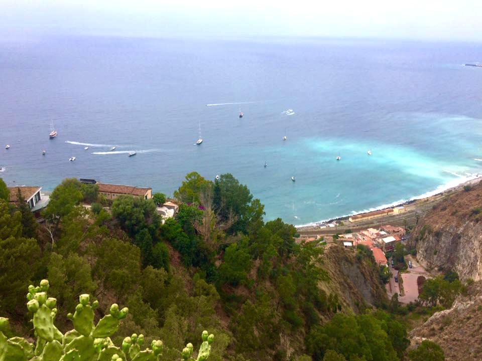
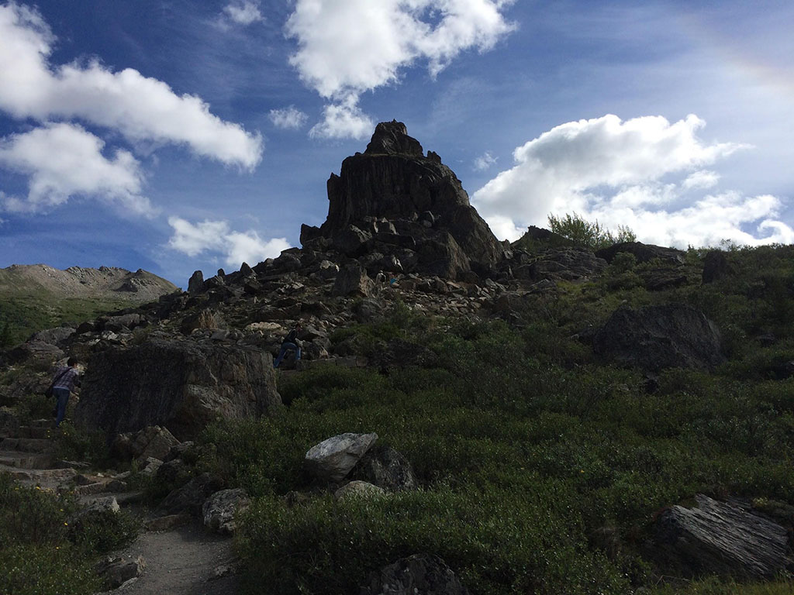
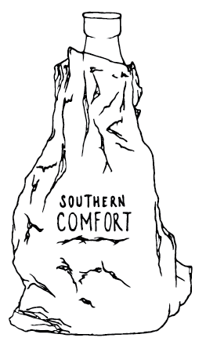
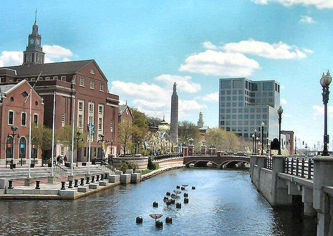
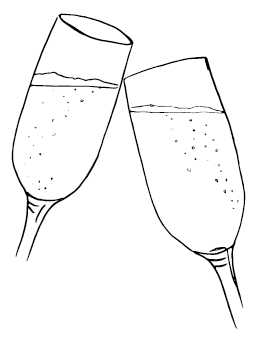
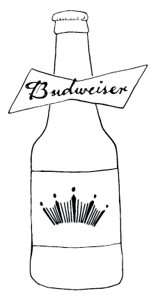
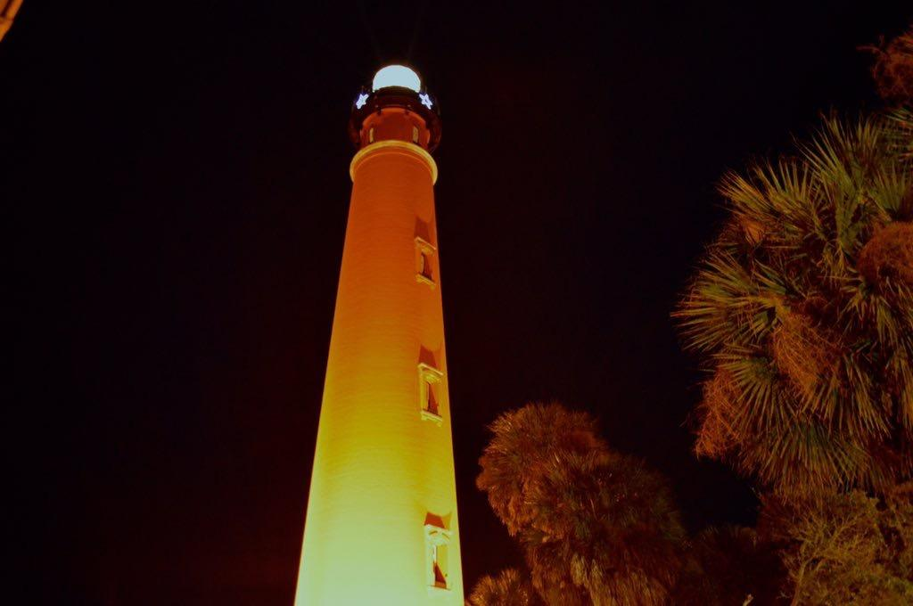

# THE WRITER'S BREW: AN UNFILTERED GUIDE TO THE BEST WRITING SPACES

**Written by:** Student Authors from Miami University

**Edited by:** Chase Bailey, Haley Jena, Claire Podges, and Rebecca Sowell

Version 1.0, May 2018

This book was produced with Pandoc from a Markdown document. The source files are available at [Github](http://www.github.com/timlockridge/thewritersbrew).

For questions about this book, contact Professor Timothy Lockridge: timlockridge@miamioh.edu

This work is licensed under a Creative Commons Attribution-Non-Commercial-ShareAlike 4.0 International License.

## A TOAST

This project would not have been possible without the guidance and
encouragement of our Print and Digital Editing professor, Dr. Timothy
Lockridge. We also would like to acknowledge the hard work and
contributions of our fellow editing students. You are the body and blood
of this book and we are incredibly proud to showcase your creativity. We
are especially grateful for Natasha Quitano for the illustrations of the
drinks appearing at the beginning of each story. Finally, thank you to
the members of our group: Chase Bailey, Haley Jena, Claire Podges, and
Rebecca Sowell. Here's to a dazzling future of writing and editing.
Cheers!

## INTRODUCTION

*The Writer's Brew: An Unfiltered Guide to the Best Writing Spaces* is
an anthology of stories collected for a Miami University class project.
The authors' stories are accounts of the places they feel most
comfortable, productive, or inspired to write. The writing spaces span
the world as well as the imagination. From the bank of the Seine in
Paris to the front porch of your college house all the way to the
critical last minute of a deadline, *The Writer's Brew* encompasses the
writer's strange, albeit effective, tactics for producing a piece of
writing. The authors of this anthology have also provided a
complimentary drink they believe to characterize the space of their
choice.

The factors that influence the final product of a drink, such as the
region the grapes of a wine are grown in or the way a coffee bean is
roasted, can be seen in the way certain factors influence the final
product of a piece of writing. Region, temperature, smell, and sound all
affect the way an impression is set into something. This anthology
offers suggestions of how to collect these influences and distill them
into a piece of writing.

The sections of this guide are arranged according to the classification
of the author's choice of drink. *Spirits* encompasses places of sharp
passion, high energy, and racing inspiration. *Beer & Wine* are places
of relaxed scrawling and classic elegancies. *Anytime Drinks* induces
thoughts of your favorite coffee shop and refreshes your memories about
what it was like to be a new writer. Whether you find inspiration
finishing a line at the bottom of the page or seeing an image in your
tea leaves at the bottom of a mug, we hope this anthology offers you
creative suggestions of the importance of space (both new and old) when
it comes to writing.

## SPIRITS

Some pieces of writing, no less valued than others, are created frantic
and fast; the burn of the words you spill out singe your throat as they
go and your vision varies in its clarity as you speed through the whole
piece at once. We like to call this binge writing, and what better to
accompany this type of writing than the chosen drink of famously
tortured writers everywhere: spirits. It's arguable that these writers
turned to hard liquor to numb their internal pain, but it also is seen
as a way to extract the most honest and unfiltered ideas. Whether the
drink is as straight up as an opinion piece, or is mixed and enhanced by
others like a collaboration, hard alcohol is sure to bring the sharp
sting of inspiration.

## La Campagna

By Hannah Blackwell

Photo by L. Yako. Used with permission.

**Drink of Choice:** Limoncello. The traditional Sicilian liqueur is
frequently homemade throughout the region and mirrors the sweetness of
the poppies.

Just like fine wine and rich chocolate, great writing is a delicacy. It
takes the best ingredients to produce a sensational product. A fine
facility is key to the production of this product. It provides the
craftsman with the ingredients of inspiration and relaxation needed to
make something truly delectable. It must open the craftsman's mind and
set it free from reality, completely submerging it in layers and the
vastness of the present place. It must allow the craftsman much gain,
but ask nothing in return. This place---as I have found it---cannot be
contained amidst four walls. It cannot trap one's mind in a limited
space, but must let it roam free over a vast scenery. Texture must be
visible in a rugged terrain, and beauty must challenge the ruggedness. A
sea of blue adds a calming sense, and a slight warm breeze allows for
maximum comfort. I have found one place on Earth that meets these
criteria. This place gives the conscious and subconscious mind a freedom
never before experienced. It provides the essential ingredients for fine
writing. This place resides in the mountainsides of Sicily, Italy. It is
a place where farmers nurture their crops and families escape the
cramped cities. It is where the mountains seem to meet the sea and where
poppies grow alongside cacti and grapevines. This place is the setting
of great love stories and horrible deaths, but no movie has ever truly
captured the good it does for the soul. This is where opposites meet and
intertwine to produce magnificent beauty. This place is called *la
campagna*.

Photo by Hannah Blackwell. Used with permission.

### History

Unlike much of the boot of Italy, Sicily is a rather poor and neglected
region. While the North is made of up-and-coming cities and bustling
tourist towns, the island of Sicily is made of mostly rugged mountain
terrain. While Northerners are successful business people and government
workers, Sicilians are farmers and unemployed workers. There is little
opportunity for work in Sicily due to corruption and an economy that has
been struck down time and time again. Once ruled by thriving monarchies,
the steadfast economy slowly deteriorated as the island was colonized
and the monarchies fell. Sicily became an island prone to trade, one
country giving it up to the next for something greater. "The northerners
came to view themselves as citizens who believed they could determine
their own collective destiny, while the southerners thought of
themselves as the neglected subjects that they were."[^1] To this day,
most Sicilians do not call themselves Italians, and many Northern
Italians do not think of them as Italians either. To the Northerners,
Sicilians are the leftover runts of the region they are forced to keep.

### The Countryside

The Sicilian countryside, or *la campagna*, is an oasis for many from
cramped city-living. The direct translation of this phrase to English is
"the country," but the American connotation that goes along with this
does not do it justice. The American "country" is thought to be a place
of country-style music, cowboy boots, hunting, and agriculture. In
Sicily, the country is an escape. This peaceful land is spotted with
agriculture consisting mostly of olive trees, vineyards, fruit trees,
and almond trees, each plot backing up to its own villa. Villas vary in
size and structure, some just four stone walls and a porch while others
in excessive size boast beautiful wrought iron balconies. Whatever style
of house, a porch is a must. The porch of a Sicilian campagna villa is
equivalent to the vast porches that were essential to American homes of
the nineteenth and early twentieth centuries. It is the sitting area of
the house, the place where the breeze hits just right and the blazing
desert sun cannot touch. This is the place of tranquility, relaxation,
and rejuvenation.

Alongside the agriculture grow cacti and tufts of wild brush. The most
common cactus plant of the area is called the *ficodindia*, which
translates to "prickly pear." These cacti grow small fruit that are hard
and piney on the outside with a sweet and tender interior. During my
first visit to Sicily, my cousin gave me the nickname Ficodindia
comparing my personality to the fruit. The most Sicilian experience I
have had was snacking on this delicious fruit overlooking their land
from which it was picked on the porch of my family's villa.

### Landscape

Looking out from the porch of the villa, one can't help but notice the
rugged terrain. Vast mountain ranges cover most of the island, topped
with the occasional castle built into the rock. Along with wild brush,
cacti, and farms, a beautiful weed grows rampant across the dry land in
the early summer: fields of bright red poppies can be seen covering
hillsides and growing out of cracks in old concrete. Anywhere there is
free, untouched space, a poppy can be found. The beauty of these flowers
seems to soften the landscape, making the scarcely lush mountains with
their jagged rock formations a little more appealing. Yet it is almost
as if this contradiction of beauty versus the unforgiving mountainscape
is necessary and purposeful---that without it Sicily would not be
complete. Without the poppies, the land would lack the color and
vibrancy for which so many are attracted to the Italian landscape.[^2]

Behind the mountains---if just the right mountain is picked---the deep
blues of the sea can be seen. Sicily is surrounded by the Tyrrhenian
Sea, Messina Strait, Ionian Sea, and the Mediterranean Sea.[^3] Each
sparkles in a way only salt water can. The view of the sea is
liberating. The calm sea, with its never-ending blue, contrasted against
the mountains captures the mind's eye. This is why la campagna is a
favored place among Sicilians. Their lives are plagued by unemployment
and economic struggles, intense desert heat, and noisy, crowded towns.
The buildings of the towns are old and deteriorating and the streets are
always alive with car horns and the loud banter of neighbors---there is
no chance for peace to rejuvenate the mind and body. Yet, in la campagna
all of this is possible. With such a view, a mind can focus and find
inspiration in its layers.

Photo by Hannah Blackwell. Used with permission.

Sicilian beauty is at the heart of many works of literature and film.
This land and culture allure the heart and inspire the soul. As I sit
looking out over the terrain and sea from the modest porch of my
family's villa, I am overcome with emotion and passion for the place in
which I am blessed to know. My mind is allowed to wander here, to mix
the soft blue of the ocean, the jaggedness of the mountains, and the
bright red of the poppies into something entirely my own. If I were a
painter, I would paint such a scene over and over. But since I am a
writer, I will use this perfect writing space in the comfort of the
shade and breeze to make my writing a delicacy.

## Reunion's Front Porch Swing

By Neely Coffey

Photo by Neely Coffey. Used with permission.

**Drink of Choice:** A homemade Bloody Mary with "all the works." Much
like the porch of Reunion, this drink is a concoction of spice and good
times.

With each swing creaking, back and forth, and back and forth, I take in
everything that goes on around me. The porch swing has been passed down
through the years and manages to sustain life on the porch of Reunion.
Reunion is an ugly white house on the corner of Poplar and Collins that
gets passed down through the years by the Pi Phi sorority. With its
purple front door and dirty walls, the house has the well-known Oxford
charm of a college student's home, but the swing has its own essence of
familiarity.

### The Porch

As you walk up Reunion's three front steps, past the hedges guarding the
house, and to the porch, you get a faint whiff of trash---a lingering
smell that never seems to completely dissipate when it's warm outside.
The first thing you see is the fading lavender-colored front door and
the address, one-zero-one, but the zero is missing and was replaced with
a sloppy marker-drawn zero. On the front door, you notice the remnants
of a splattered milkshake that hardened after months of the sun beating
down on it; it is the leftover evidence of an old battle between two
neighboring houses. As you scan the rest of the large, white-yellowish
porch, you notice the front door isn't the only place with a disgusting
pattern of milkshake. The walls, covered in substances long before our
time in the house, are a good indicator of all that has occurred at
Reunion.

The deeper you get on the porch, the more bugs you may encounter. On a
warm, sunny day, mosquitoes and wasps swarm the many benches and couches
that fill the area. Looking over the railing that guards the porch, you
notice worn bottle caps that look like they've been there since before
the turn of the twenty-first century. Finally, you reach the back left
corner of the porch, and you reach the best location in all of Oxford:
the swing.

Photo by Neely Coffey. Used with permission.

### The Swing

The somewhat rusting gray swing with two seats and overhead bar sits at
the very farthest corner of the porch. While sitting on the swing, you
get the most encompassing view of the cornering streets. The house sits
on a hill, so it faces all the way down Collins Street and all the way
up Poplar Street­­ viewing the near Uptown Oxford. The swing is
surrounded by the lush, green hedges. It makes you feel secluded. You
can see all around, but the bushes keep everyone from seeing in. It's
the perfect place to watch students trek back and forth on their daily
walks to campus, their homes, and Uptown.

The swinging bench rocks back and forth at a comfortable pace. The pace
is fast enough that you're moving, but slow enough that you don't really
realize you're moving. With each swing, there is a faint clicking noise.
There is usually a nice breeze that wraps around the house and plenty of
sunshine during the day. At night, twinkling lights meander around the
porch poles. The atmosphere is calming and joyful.

### Writing

Your first thought when sitting on a swinging bench on a somewhat
pedestrian-filled street usually wouldn't be, "I'm going to sit and
write, right here." But when you do finally decide to sit down and
write, you realize it is the greatest and most under-appreciated writing
spot. There is always so much going on around the porch with inspiring
material. Sitting on that swing and writing will bring you a different
type of joy you might not have experienced before as an author. There
are always people walking by, laughing and talking to their friends.
Often times, you can faintly hear someone's music in the distance. It
seems like it would be distracting, but you become accustomed and in
tune with the noises around you. Nothing else matters except you and the
stroke of your keys on your laptop. The girls who live in the house are
often walking in and out. They stop to have a conversation and exchange
pleasantries. Then they go inside and you are focused once again on the
piece in front of you. On a beautiful Oxford day, there is nothing more
peaceful than this experience. The sun shines just the right amount,
giving you the best view in town.

While it seems logical that the best place to write would be at a desk
with a pencil and paper, it isn't. Whether you are struggling to write a
tasking assignment for class, a creative piece, writing for fun, or
simply putting something down in a journal, the most inspirational and
gratifying place might be the most obscure. The front porch is dirty,
sticky, and somewhat smelly, yet it is one of the happiest places to sit
and spend an evening. The swing is old and creaky, yet so entirely
familiar---you don't have to live there to appreciate it. There is an
overwhelming aura and sense of all the wonderful memories that have
occurred within the area, it almost spills from the atmosphere into your
writing. The front porch and the swing that steals the show is simply an
author's sanctuary.

## L'Appel Du Vide

By Alex Grana

Photo by Miro Alt, Creative Commons license. Used with permission.

**Drink of Choice**: What better to pair with jolt of realization than
Fireball? Whisky is the choice of pained authors everywhere, and adding
cinnamon brings a dramatic twist to the sharp drink.

### Background

*L'appel du vide*.

Collins Dictionary defines this French phrase as a significantly used
phenomenon to describe the instinctive urge to jump from high places. It
translates to "the call of the void."

Beyond being linked to sudden suicide ideation, *l'appel du vide* is the
brain's way of coping with extreme situations by driving you to want to
take the most concrete action possible. It just happens to be very
commonly linked with the high-place phenomenon, understandably so.

As a child, you sit on the lakeshore with your feet buried in the warm
sand, hands curled around your Gameboy Advance. Your little sister sits
next to you, spread out on a beach towel, keying at her Nintendo DS and
chewing on the end of her stylus. The device looks oversized in her
small hands. The ebbing water licks your toes. You have the itching
compulsion to toss your video game into the lake.

*L'appel du vide.*

You don't, obviously. Why would you drop your Gameboy into the water?
You stare blankly at the blinking Pokemon on screen. The screen is at
maximum brightness to counteract the sun's glare. You hold onto the game
a little bit tighter.

You are a teenager when those intrusive thoughts crowd the back of your
brain again. It's similar: you're in line for a roller coaster, the
stairs hoisting you towards the terminal slats of grate beneath your
feet. Your arm is outstretched as you Snapchat a selfie of you and your
friends, faces pressed together to fit in the portrait frame, when it
occurs to you that you could just drop it. It would slip through the
grate and smash on the concrete a story below.

Does this feeling only ever happen when you are at risk of destroying
something expensive?

Worry vibrates at the base of your skull. You rush through a dozen
different scenarios of achieving total finality with your potential
actions. *Concrete* actions. Shattered screens or shattered knees on the
pavement below, it's all brought on the same way. You add the Snapchat
to your story.

What better way to push through writer\'s block than to put yourself in
a situation that forces your body into a state of action?

Even if what you write is trash, you wrote it. Work can be edited,
revised, and rewritten.

So you find a place that ignites that nagging sensation at the back of
your thoughts. Maybe you manage to break onto the balcony of Miami
University's Art and Architecture Library and you sit with your laptop
as close to the guardrail as you can while still being able to focus.

Maybe you find a spectacular cliffside where you can spread out your
notebook and collection of colored pens and watch the water churn on the
rocky shore below, the sound of the waves and the wind like a great
sleeping beast lulling your pen into a rhythm. You go to a place where
you can comfortably create, somewhere that will not horribly tease your
mental stability and convince you to actually take the leap.

But you are a writer, you are not a part of the most emotionally sound
bunch. Sacrifices

must be made for the art of it all.

### Getting to Work

*L'appel du vide.*

You settle for a place with a good view.

The fenced-in balcony at the top of the Art and Architecture Library is
not very high up, but knowing you're not really allowed to be out there
adds to the thrill of it all.

Dipping your toes into one of the creeks running through Western campus
at Miami University while carefully keying away at your laptop gets the
job done too. The sun presses into your bare shoulders, you can feel the
beginnings of a sunburn bubbling up on your flesh.

Maybe you go the adventurous extra mile and set up camp at a cemetery,
void in a way not many other places are, a constant reminder of the
final possible *concrete* action, an open invitation for intrusive
thoughts. There's a tree with deep and twisted roots, likely older than
the town itself.

You plant yourself in the dark earth and conjure your story. The sense
of restlessness this place evokes inspires you to breathe life into the
thing that has so evaded you. Long days at class and work have worn you
down and in turn you have worn down the path you walk through life, a
rut that stretches across daily activities.

Here, you can sew the limbs onto your creature. The sense of anxiety
this place stirs in you is like TV static buzzing behind your eyes. Its
heart had sat on your bookshelf for months, staring you down. You
constructed its ribcage with your bare hands. You fed it pages upon
pages of all your favorite books, from the days when it still had baby
teeth and molars rattling around as it chewed, embedded in its jaw.

Your fingers work tirelessly on your keyboard. Sometimes, you take short
breaks; you get up and stretch your legs, seeking to upset the
equilibrium in your brain again. You venture a little too close to the
edge. You peer over.

The view from way up here shocks you again. You go back to your story.

This jumpstart is exactly what your story needed. Where there was blank
pages and an ever-growing Pinterest mood board, there is now words
clinging to the page. The words have been catapulted to the document and
now they leave their inky stains across screen. It was frantic and
unsettled but it was perfect.

Caution be damned, you can edit it later.

You don't let yourself delete a single word.

## Denali National Park

By Mason Moser

Photo courtesy of Wikimedia Commons. Used with permission.

**Drink of Choice:** Glenlivet 18. A nice top shelf scotch to accompany
the majesty of the Alaskan frontier.

Mount Denali, the tallest peak in North America is not just a mountain,
but a monolith of such magnitude that it can be seen from over one
hundred miles away on a clear day. It has a peak height of 20,310 feet
and is surrounded by six million acres of land (the same acreage as
Vermont). Denali is a massive piece of land resting in the center of
Alaska[^4]. On a perfect day it is possible to see the peak of Denali
reaching into the sky from as far as Anchorage, roughly 130 miles
away[^5]. Alaska truly is a wild frontier where there are more caribou
than people, and even then 40 percent of the human population lives in
Anchorage[^6]. The capital, Juno, can't even be driven to. In order to
reach the capital you must either fly or take a boat.

In my own experience, the levels of civilization changed just as quickly
as the miles gained from leaving town. In Anchorage it is possible to
live a normal city lifestyle, free of the challenges of the vast
wilderness that dominate the overwhelming majority of the state.
However, as you leave Anchorage, or even a smaller town on the road
between larger destinations, it becomes apparent that there are all
kinds of people living diverse lifestyles just a mile down the road from
each other. Those in town can have running water and electricity, but a
neighbor a mile down the road might have neither of those things.

Who can blame them when the electric company wants to charge several
thousand dollars per powerline?

### My Journey

I travelled to Alaska in the summer of 2014 to vacation, as well as to
attend my cousin's wedding. He lives near Fairbanks, so it wasn't a
destination wedding, and honestly I would only see Alaska being a
location for something like that in the summer when the sun skips off
the horizon, but never really goes away. Who can complain with twenty
hour days where it's 60-70 degrees. I arrived in time for the last
spurts of a large wildfire somewhere beyond Fairbanks making the first
few days as hazy and smoky as standing downwind from a campfire.

The taste of smoke took several days to leave my palette while exploring
the flat riverlands where Fairbanks is located. The things I experienced
there were only the warm up to what I would see in Talkeetna, a small
town just outside the borders of Denali National Park.

Part of my own experience in Alaska was searching for inspiration for
the sci-fi novel I have spent years working on. It's a large toll on the
imagination to envision new planets with exotic locations and find a way
to place my characters within those spaces. I thought that Alaska would
be the perfect place to experiment with the grandiose frontier
environments and to place my characters within them. For the two weeks
that I was there, my characters accompanied me everywhere, and slowly I
came to understand them a little better. It helped that I met a variety
of strange people living to the best of their ability in the frontier
that is Alaska.

### Dom, the Lunatic

The craziest man I've ever met lived just outside of Fairbanks. He was
half Eskimo, half New Yorker. His name was Dom and he lived up on a hill
in a red apartment that was built like a big square house. He was in the
middle of renovations, but he eccentrically led me around his apartment
and showed me the whale vertebrae he was drying in the yard, as well as
the bear pelt he slept on in lieu of a bed. Up on his porch he grew
marijuana and down below he carved bulbous, knotted wood carvings.

His cousin, a true Eskimo hunter with grey eyes of a wolf, treated my
family to stories of his hunts. At the age of ten he killed a whale for
his village, and has hunted everything from bears, to wolves, and even
sheep in the highest altitudes of the Brooks Range. Dom told us that
he'd crashed his plane three times and had backpacked it, along with
himself, out of the mountains, and somehow managed to have his boat
explode with him on it.

They shared with us the freshest salmon and moose meat I have ever
tasted, as well as Muktuk, a delicacy made of whale blubber and skin.
Think octopus, but even more rubbery. It was here, before travelling
towards Denali National Park, that I experienced a little about how true
Alaskans live.

Photo by Mason Moser. Used with permission.

### A Horseback Ride Through the White Range

Off a road in the middle of nowhere, an Eastern European woman who kept
a 10mm pistol on her hip took care of four horses throughout the year.
She lived in constant need of getting fresh water for the horses, even
during the winter, and told me that it'd be cheaper to shoot the horses
as winter approached and get new ones in the spring, rather than to take
care of them all year.

We rode for hours through the outer-mountain valleys of the White Range,
with Denali standing like a monolith at the center somewhere in the
distance. We crossed dry river beds filled with rounded white stones
larger than bowling balls. Through forested trails and hills we rode
until coming to a clearing somewhere upriver to take a break. All the
while I tailored what I'd seen and heard to imagine my characters
occupying this place. What would their lives look like in a place where
a high-caliber pistol round to the skull of a moose only pissed it off?

### An Interaction With a Familiar Face

Photo by Mason Moser. Used with permission.

On top of a hill looking out over the rolling valleys that snake upward
to the glaciers slowly grinding their way through the Alaskan Range,
there is a man sitting with his legs swinging over the edge of a large
boulder. I climbed to the top of the rock and stood behind him for a
moment. I had climbed up the hill from the direction he was facing with
my eyes directed toward the top the entire time, yet only now he
appeared before me.

"To think that the entirety of this place is bisected by one 92-mile
long road," the man says without turning. "Have you been on the tour?"

"I haven't."

I find it odd that I replied so calmly and without hesitation. For
standing behind a complete stranger, I felt completely at ease with this
man. I could tell even as he sat there that he was tall, like me. I'd be
lying if I said I wasn't envious of him sitting there swinging his legs.
There aren't many places a tall person can sit to liberate their legs
from the stress of supporting their large frames.

His short, thick grey hair suggested that he was middle-aged, but his
physique betrayed that. The fitted climbing shirt that he wore revealed
the body of a warrior. I must have been entranced by his muscles since I
didn't immediately notice him turn to look at me. His soft blue eyes and
thick grey beard hid his strong facial features, but I immediately
thought that this person was the most jacked grandpa I had ever seen in
my life.

"Come sit beside me and enjoy the view."

I sat beside him as he returned his gaze to the valley that extended
before us. It was impressive and monstrous to think that the slice of
the lands we could see beyond the confinements of the valley were
infinitesimal to the whole of Alaska. The mountains beyond gave no
perspective to the scope to the hundreds of miles of land in all
directions that were still "Alaska."

"Who are you?" I ask absentmindedly. There's a connection between this
familiar man and this place.

"If you think about it, I'm sure my name will come to the tip of your
tongue."

"Maximus..." I say as an eagle follows a downward draft to the river
where it scans for fish at a low altitude.

"That's me."

"You look different than normal." This man is my creation. He is the
main character in my novel. I've never imagined him to be so cheerful,
but as he appears before me in this place, he looks content with where
he is.

He turns and looks at me with his bright blue eyes and says, "Haven't
you figured it out yet?"

I don't know what he's referring to. "No?"

"In this place you can clearly see me, can't you? Doesn't that say
something about what you've been looking for in my character?"

"I'm not sure. I've imagined you and the others over and over again
here, but I still can't envision you the way I want."

"Don't force yourself. You're writing me right now. Changing me slowly
into the person you envision. So sit back and enjoy the view."

## Writing from Under

By MaKayla Reichert

Photo by MaKayla Reichert. Used with permission.

**Drink of Choice:** A bottle of Southern Comfort wrapped in a brown
paper bag. What else would you drink underneath a bridge?

### Coffee's for Closers

Coffee shops have no soul. Don't get me wrong, I've known many writers
who can sit down with a latte at the nearest anti-Starbucks hipster brew
joint and turn out word after word. If this is your writing spot, I
apologize. I don't write to offend. It just isn't mine.

I can't concentrate in a sea of voices like some people can. The words
are intelligible. They can be neatly plucked from the quiet background
noise of ordering and hushed chatter. Sometimes those words end up typed
on my screen, and I am left distracted from my work.

In a perfect world, maybe the conversations of strangers would be
inspiring, and maybe sometimes that is true. In my reality, however, the
snippets of dialogue are very specific to the coffee shop "type," and
will never be as inspiring to me as what I collect on the streets at
weird hours of the night. I like to see humanity raw, not presenting,
which draws me to certain human structures that offer a greater
understanding of the dirt.

My favorite places to slam out some sentences is under an old bridge in
my town. I'll have my Frap when I'm done.

### The Bridge

It's a small bridge, and a rural one. Not my first choice of bridges,
but a bridge nonetheless. It's an urban landmark imposed on nature. It
runs over a dried-out creek bed, which is where I make myself at home.
The asphalt fades into gravel, from one road to a smaller one. The sound
of cars passing over reverberates in the tunnel and sometimes pebbles
drop off the edges. The cars are few and far between, which leaves only
the sound of rustling leaves and birds singing in the distance.

There is no Wi-Fi under the bridge, nor power outlets. A charged
computer and a Word document suit me just fine. Sometimes I bring a
notebook and pencil (for poetry only) and bask in the warmth of
nostalgia. The distractions are limited to the vibration of cars as they
pass overhead, which frankly tend to be a wake-up call. Nothing incites
productivity like adrenaline, a fact that all procrastinators will
attest to. I love the juxtaposition of the peaceful sounds of nature and
violent interruptions. The rural scene framed by the end of the tunnel
makes it seem like a well-lit landscape painting in a dark exhibit. It
conflicts with other forms of art that line the concrete walls.

### The Walls

Graffiti is art. Graffiti inspires me more than a stranger's
conversation ever will. Spray-paint is the poised fingers on the
keyboard for someone else's rhetoric. The stakes are higher and the
words are interesting. The images are interesting. Protest, and even the
protest inherent within obscenity, appeals to me. What drives someone to
slander on concrete? Who do they think will see it? Certainly, I am not
the intended audience.

This is the place I like to wrap myself in, because I think of it as a
breeding ground for creativity. Writing is, in my opinion, a textual
snapshot of human experience. Surrounded by juxtaposing ideas, I try to
take someone else's headspace. I value perspectives, especially in
writing prose, and so this space appeals to me. While another human
would be distracting to me while typing, I still feel connected to
humanity here.

My suggestion to anyone with writer's block is to find a bridge, crawl
under it, and study the way it connects you to the rest of the world.
That's what bridges are for, anyway.

### The Tunnel

I have no authoritative preference when it comes to tunnels, but the
Lincoln Tunnel does come to mind. Its length gives it an edge for
jotting down some text. It gives perspective on different human
experiences. The tunnel is, in a way, a metaphor for time (and for
anyone who has ever attempted Lincoln in rush hour, this will be even
more poignant). The tunnel is linear, it moves only forward. There is no
speeding ahead, the pace is set by the car in front of you. There is no
turning around, only moving forward. The lights are trippy and can lull
one into a trance-like state. Dissociation can breed interesting ideas.

When going through the tunnel it is important to note that there is
nearly one hundred feet of water overhead. The only thing that keeps the
Hudson River from collapsing in at any moment is a man-made structure. I
like writing in this space because it illuminates mortality and the
human perception of death. In some ways, we play God.

Car horns spiral bounce off tiled walls, indicating either frustration
or reverie (depending on the driver's locality). The duality of man is
astounding. One harrowing, mundane commute for a New Yorker is a true
experience for someone like me. Humans and cars are such a compelling
case study. Why do people honk in tunnels? Notice the way that people in
cars forget that other vehicles contain life as well. How do certain
people react to traffic or the open road? How often do I wave to someone
in front of me compared to how many times I raise my middle finger?
There is much to learn in these small moments.

Sitting bright-eyed in the passenger seat, I can experience it.
Connecting to the space is part of a great setting. The idea is to
experience, let the emotion and thought wash over me, and then reflect
it back into the art. I prefer to write in the notes app on my phone.
It's easy and accessible, and the backlit screen works wonders against
the dim, industrial lights outside of the vehicle.

### Paint it Black

There is so much to observe in places that are not conventionally
beautiful. Gorgeous marble monuments and museums of meticulous
oil-paintings are inspiring aesthetics, but how much of humanity do they
capture? Michelangelo's David is an iconic sculpture, but studying his
rock-hard abs and writing on his form falls short of capturing the
average human figure. Would it not be much more interesting to cultivate
a narrative where one feels sympathy for an average-looking individual?
The shortcomings and flaws of each individual are what flush them out as
a person rather than a grotesque. Superman is boring with his perfect
moral standards and total capabilities. The villains liven the plot with
their inherent intrigue, but they, too, grow boring without some balance
of sympathetic characteristics. Settings are exactly the same way.

Exploring spaces with flaws leads to questions that provoke thought.
Places retain the fingerprints (and other marks) of former life that
existed there. Take every opportunity to play anthropologist and explore
the stories in the dirt and mediocrity around you.

## Under the Sea

By Allie Springer

Photo courtesy of Creative Commons/Flickr. Used with permission.

**Drink of Choice**: A fishbowl. Classically made with blue curacao
liqueur, vodka, and Swedish Fish, its stark similarity to the actual
fish tanks will only be made better with the sugary sweetness that comes
with each sip.

As writers, we all dread writer's block. We've all been sitting at our
desks when out of nowhere, our inspiration and motivation disappear:
poof, gone. Frustrating as this may be, I find there are a few ways to
solve this issue. Some people need brain food, some start a central IV
line of coffee, and some just take a break and come back later. However,
a change of scenery is what usually helps me most.

When faced with the question of where to write, the options are
seemingly endless. Libraries are quiet with plenty of workspace and
books to help with research, coffee shops provide a never ending supply
of caffeine, and your own house or office has the benefit of comfort.
The latter is nice because you can lie in bed and write while wearing
cozy pajamas. However, some of your best writing might take place in the
locations you never think of visiting. For instance, have you ever
thought of taking your laptop or notebook and hunkering down in an
aquarium? Probably not, but hear me out. First, there are specific
conditions that make this an ideal setting (depending on what you
personally need to be able to write). Not all aquariums are suited for
our purposes. You need a place to comfortably sit, a view of the fish,
and hopefully a spot that is fairly quiet and lacks screaming children.
If you're a magical unicorn author who is able to write standing up
surrounded by distracting noise all day, feel free to disregard what
I've just said. But for the rest of us, keep it in mind when selecting a
location.

After you've chosen your spot and settled down, it's finally time to
write. Pull out your notebook and writing utensil, or more
realistically, your laptop. An aquarium helps provide much needed
inspiration in a few ways. Obviously, people-watching is easy since
you're in a public space. Do you need character inspiration? There are
countless visitors that can suit your needs. Keep an eye on the mother
attentively watching her children, the teenager sulking in the corner,
the employee energetically spouting information about marine life, and
the little girl with her face pressed to the aquarium glass, her eyes
filled with wonder. Even writing down these observations can add to your
writing or motivate you to start anew.

This is a pleasant spot to focus and settle your mind, too. If
background noise bothers you, bring a pair of headphones along so you
can listen to your own soundtrack for life while you watch the fish.
It's unlikely that you'll find a silent spot, but hopefully you can find
an area that's quiet enough for you to provide your own soundtrack. Once
you're settled, look through the glass. There's something peaceful about
the way life works in an aquarium. Each fish swims calmly in their
environment, performing an oceanic dance as they interact with others.
For them, life is simple. It's easy to get lost watching their movements
as they traverse their humongous tank. The longer you watch, the more
you notice. The tiny starfish creeping along the sandy floor, the blue
tang fish hiding amongst the coral, and even a small baby shark
repeatedly circling the length of the tank weren't noticed when you
first began to watch. As your mind wanders watching the fish, let your
hands begin to flow freely and jot down thoughts, observations, plots,
and ideas.

Aquariums are often located within zoos, and even if they are not, tasty
snacks will most likely be readily available. If you get hungry or
thirsty you can easily grab something to eat as long as you don't mind
paying inflated prices. It may not be the healthiest food, but eating
junk food may put you in a better mood to write (especially if you get a
sugar rush from candy).

Getting antsy? Feet falling asleep? At the aquarium there's no need to
worry. There's plenty of room to get up and move around. Explore the
building, look at the different exhibits, observe the fish, use the
restroom. After this, it's important to get back to your writing, you
don't want to be distracted for too terribly long. If you get bored of
sitting in one spot, there are normally different areas you can move to
as well that provide different views. Even a change of scenery within
the place you used for a change of scenery can be helpful in the writing
process.

I find that when I visit the aquarium, I enjoy it because it reminds me
of when I was a kid. The bright and vivid colors are beautiful to look
at, and for me, this always calmed my mind. We're all different though.
For instance, if you can only work in silent spaces while sitting at a
desk, this space probably isn't best for you. Do you thrive while
surrounded by movement and action? Stop reading this and go to an
aquarium right now. If you're able to churn out quality writing, the few
bucks you'll have to shell out to get in will be repaid tenfold when
you're a famous author one day.

Now go out there and write! Armed with a perfect location and motivation
to last for years, get out there and do your best. Even at the most
ideal location in the world, your best is all you can do. So do it.

## Down the Rabbit Hole

By Jessi Wright

**Drink of Choice:** Absinthe. There is no better way to create a
wonderland than to hallucinate one.

> "'But I don't want to go among mad people,' Alice remarked.\
'Oh, you can't help that,' said the Cat: 'we're all mad here. I'm mad.
You're mad.'\
'How do you know I'm mad?' said Alice.\
'You must be,' said the Cat, 'or you wouldn't have come here.'"

> -Lewis Carroll, *Alice's Adventures in Wonderland*

You must be mad if you're a writer looking for advice on where to write
in order to discover how to write. You must be, or you wouldn't have
come here. But allow me to guide you this way and that way until you've
found where you want to go in your story. Whether it is through the
phraseology and history of tunnels to mystic realities or the
methodology by which to dig your own, let us get lost down the rabbit
hole---for this is the only way to create a wonderland.

Illustration by Sir John Tenniel; photo courtesy of Flickr. Used with permission.

### Etymology

The beloved phrase, "down the rabbit hole," originated from Lewis
Carroll's *Alice's Adventures in Wonderland* [^7] and was made popular
by multiple Disney renditions of the children's book, including the old
and the new *Alice in Wonderland* movies[^8]^-^[^9], and the more recent
*Through the Looking Glass* film[^10]. The term in such contexts means
'to become lost and enveloped in a strange, imaginary place--- an
alternate reality of sorts.' However, this phrase has recently taken a
new meaning upon being popularized by various multimedia/social media
platforms. Now many people say things like, "I'm too far down in the
crafting rabbit hole that I'm looking up how to craft accessories for my
completed crafts," or "I went down the rabbit hole looking for easy
homemade recipes and now I'm thinking Gordon Ramsay went too easy on all
of those amateur chefs," or even "Bryan Garner has led me so far down
the rabbit hole that I'm now copyediting my textbooks like they're rough
drafts." In all of these examples, the expression has taken on a new
meaning. The person in question is neither in the alternate reality of
crafting nor culinary critique nor within the strategic labyrinth of
Garner's mind. Kathryn Schulz[^11], a New Yorker journalist, defines
this new connotative interpretation well: "When we say that we fell down
the rabbit hole... we mean that we got interested in something to the
point of distraction---usually by accident, and usually to a degree that
the subject in question might not seem to merit." In her article, Schulz
continues by replacing Carroll's esteemed idiom (meaning "Deep Inside
the Alternate-Reality") with something more applicable to her own modern
reading ("Expending Vast Amounts of Time and Energy"). As an
illustration, take the "I went down the rabbit hole looking for easy
homemade recipes" demonstration from earlier. The speaker does not mean
they were lost in a psychedelic world looking for easy recipes, rather
that they had exhausted an unfathomable degree of energy into this
inessential task. Nevertheless, the true etymology of this saying goes
back further than contemporary jargon and even Carroll. It literally
means 'exploring the home of a rabbit,' which technically isn't very
deep or inspiring. Regardless, when writing down in the rabbit hole, I
suggest the application of Carroll's terminology---what better way pen
an alternate reality than to visit one yourself?

Photo courtesy of Creative Commons Zero. Used with permission.

### Application

Now we must construct the portal, since we are all not lucky enough to
stumble upon them like the charming, curious little girl we know of. The
first step is to question routine and clear the mind, so as to forget
the definitive things in life; "If I had a world of my own, everything
would be nonsense. Nothing would be what it is, because everything would
be what it isn\'t. And contrary wise, what is, it wouldn\'t be. And what
it wouldn\'t be, it would. You see?"[^12]. When there are no
presuppositions and fundamental laws to violate, a writer can easily
make rules of their own without fear of being perceived as nonsensical.

Next, you must chase the wild idea (whether sensible or not). As Alice
ran after the late, time-telling rabbit, you must pursue this seemingly
ludicrous concept with comparable vigor and curiosity. Finally, you must
fall down the rabbit hole. With nothing to hold on to, with no one to
help, with nothing to distract you from the pure sensation of falling
into an idea, you may now truly lose your mind and write of an alternate
reality. You must take in every detail, develop every thought, and write
down everything. Perhaps, once you have followed that original idea, you
too may find yourself in a wonderland of your own manifested
imagination. You'll know you're there when your pen begins to twitch
like it's alive, when your cup of coffee starts to look more like an ink
pot, when your surroundings, unbeknownst to you, suddenly morph into a
wondrous world---the product of your own ingenuity.

I hope you've found what you were looking for, the reason why you've
come here. I've offered my best: history, literature, and advice. But it
is up to you to navigate such unfamiliar territory, to understand what
is "curiouser and curiouser."[^13] For you see, the only way to write is
to embrace the madness and fall deep into the rabbit hole of creation.
Only then can you really make a wonderland of your own.

## BEER & WINE

Good things take time. Much like a fine wine or beer, the formation of
writing is key. The location of the craft---whether that be the making
of a smooth wine or beer or that novel you've been slaving away on---has
a powerful influence on the product. The finest champagnes wouldn't be
quite as fine if the grapes were farmed in Ohio, rather than the
illustrious region in France; the best stories we read might be
different if the author wrote in a place anywhere other than their
favorite. Creating beer and wine is a long, tedious process that
requires patience and passion alike, and this section of our anthology
is a perfect guide to the spots that complement its distinct
development.

## Orchids at Palm Court

By Tess Bellamy

Photo by Edsel Little; courtesy of Creative Commons. Used with
permission.

**Drink of Choice:** A guava mimosa. Elegant, delicious, and pink, this
cocktail is sure to keep you relaxed and inspired all day long for
writing---glamour included.

Giving up on the intense studying of the semester's exams and nixing the
flatline buzz of my usual laptop, I instead opt for an old-fashioned
notebook and pen. Pencils are too easily erased and the electronics I
usually depend on would ruin the atmosphere. I just want a quiet place
to concentrate while I'm writing. I want a place where I can be served
hand and foot, where the only thing I need to worry about is the scratch
of my pen on paper and my writing. The staff would take care of
everything else I needed.

Stepping into the soft amber glow of reflected candles and filigree wall
sconces, my shoes are cushioned by dark plum carpeting that I could just
dive into. Although I want to lie down, I won't, because that would be
poor etiquette. While my table is being set up, I glide over to the
pristine bar. Marble and granite cools my elbows as the bartender,
smartly dressed in an evening tuxedo, politely sizes me up.

> "On the house," he murmurs softly, sliding a sparkling Cosmopolitan my way.

"It looks like you need it." The drink itself seems to laugh and beckon,
the beverage within spilling slightly over the crystalline edges as if
teasing me.

Smiling to myself, I accept the drink, gliding my manicured nails over
the detailed countertop, their burgundy keratin tips softly clacking
their way down its surface like the feet of a nocturnal songbird. I
appreciate the satisfying clinks they make when they come in contact
with the stem of the glass. A heartfelt and familiar staccato that
signals my brain to finally take a breathe for once.

"Ma'am?"

The word floats softly through the air and rests in my ears. A soft hand
grazes my shoulder. Turning, I make my acquaintance with a waiter. He
keeps his muted eyes on the ground, gloved hand placed across his chest
as a sign of respect as he wordlessly guides me to my table. I follow
the breeze of his swallowtail suit to a quiet amethyst booth in the
corner of the plaza. It is soft and inviting, and smells slightly of
cinnamon and cloves. As I take my seat, I feel my obsessive compulsive
disorder sigh in relief as the waiter takes a silver implement out of
his pocket and flattens every crease out of the linen tablecloth.

As the wrinkles disappear from my presence, a cream-colored menu glides
past my cheek and into the empty space in front of me. Almost as if by
magic, I hear the words "first course, please" flow out of my mouth and
migrate into your waiter's expectant ears. Nodding slightly, the only
remnant of his being is the suave swallowtail swish of his suit and a
slight whiff of expensive cologne.

I blink, and a small English-style tea set appears out of thin air.
Floral jasmine wafts around my head, creating pink clouds of wonderment.
Permeating my nose and throat with its intense bouquet, I'm nearly
overwhelmed by the pureness of its flavor. The gold cup it comes in
continually blinds me and I find myself holding it tightly with the hand
not occupied by my pen, as if it's too precious to let go. Finally
releasing the cup, I pick up one of the miniature macarons off the
dainty tea tray.

Biting into it, my tongue takes a paid vacation to elsewhere. Bitter
lemon and sweet almond foxtrot on my tongue as the soft but chewy
texture caresses the inside of my mouth. Taking a not-too-polite swig of
tea, the remaining morsels dissolve into nothing and slide down my
grateful gullet. Relishing the taste, it takes a minute before you come
back to planet Earth from whatever planet you had the pleasure of
visiting. Before you know it, the trays have been whisked away by gloved
hands and unregistered faces. And, you've already written four pages of
a much-needed rough draft. Call that artistic bliss, with more
satisfying courses to come.

Smiling to myself and feeling happy about my amusé-bouche, I anxiously
await my first course. Those ever-helpful gloved hands come back to wait
on you. A smug smile almost escapes, but I hold it back and continue
jotting down my musings. A soft throat-clearing catches my attention and
I look up, briefly pausing from the work at hand.

"Ma'am, we present to you: smoked salmon with English peas and pomme
dauphine, dressed with horseradish and sorrel."

My mouth waters reflexively as the scent of salmon and spicy horseradish
fill the surrounding space. The divine smell drowns out any further
explanation of the dish. I'm enthralled---this dish looks more like art
than food, but you can tell it's going to be delicious by the scent
alone.As soon as you pierce the fish with my fork, it almost appears to
cut itself apart, with no effort on my part at all. The bright green
English peas decide to hitch a ride on my first bite of salmon, but I
can't complain. It's just too good.

Photo by Edsel Little; courtesy of Creative Commons. Used with
permission.

The salmon tastes like an adventure story and the heat from the smoke
reminds me of a quiet, but warm, kitchen stove. Accented by the
horseradish, small coals warm my tongue with their coy fire-fingers. I
haven't had a good meal in weeks, a typical college problem. Ramen
noodles, dissertations, rough edits, and sour words with tears of
exhaustion are all I've eaten before this heavenly spread. I gave my
time to others and never stored any for myself. Time is the seasoning in
food that gives it the flavor my stomach craves.

Our heads crave knowledge, our hearts crave love, but our stomachs crave
proper nutrients. Calories make our brains tick and this infusion of
nutritional greatness has my neurons set in overdrive. My drink is never
empty, but my plate is bare before I realize it. My fork hits an empty
plate, slightly ruining the atmosphere, but those gloved hands save the
day before you do any further damage.

## The Cincinnati Airport

By Paige Bremner

Photo by Edgar Claure; courtesy of Wikimedia Commons. Used with
permission.

**Drink of Choice:** Samuel Adams. What could be more perfect than two
in-house brewery locations in the Cincinnati airport? Bon voyage,
writer!

### That Certain Something

What is the one thing a writer just can't do without? Is it a laptop?
Surely not. We could make due with a notebook and pen, perhaps even a
slightly soiled napkin and half a crayon if circumstances were really
dire. Is it elusive peace and quiet and a large chunk of time free from
any and all distractions? Nope. We all know that doesn't exist. Is it
that morning cup of coffee? A case could be made for caffeine, but the
one thing a writer absolutely must have is inspiration. What a writer
needs more than anything else is food for thought---something to get the
wheels turning and the ink flowing. But where can today's writer turn
for a fresh idea in the current climate of derivative tween romance
fantasies and overabundant celebrity memoirs? There must be a place a
writer can go to absorb a healthy dose of unique concepts over the
course of an hour or two---a place where authentic dialogue converges
with characters, both rare and ordinary, in a situation injected with
potential energy everyday. Lucky for you, writer, this place is not
stuff of fantasy. No, this ultimate incubator of stories---this cradle
of inspiration---is a real place: the Cincinnati Airport.

### The Inconspicuous Observer

From the moment you park your car and load the communal shuttle,
boarding pass in hand, you'll have free reign to observe those around
you while attracting virtually no suspicion. As the shuttle fills up,
you may find yourself sitting adjacent to a young couple headed home to
New York so that he can meet her parents for the very first time. As you
sit casually, and watch his leg nervously tap, no one would blame you
for overhearing that her parents have two adorable pit bulls and that he
is allergic to dogs. As you exit the shuttle with your luggage and enter
the airport to make your way to security, you might see a middle-aged
man checking a soft-sided bag roughly twice his height, forcing you to
imagine what could possibly be in that bag. As you are prompted to
remove your shoes and take the laptop out of your bag at security, you
might encounter an 85-year-old woman loudly expressing her displeasure
as an equally displeased TSA agent pats her down. On your way to the
gate, there's a chance that you might encounter a twenty-member middle
school gymnastics team that seems to be supervised by one rather
unfortunate mother who glances longingly at a bar while she tries to
herd the group to concourse B. Even if you don't experience any of these
encounters, chances are you will have picked up enough interesting
tidbits along the way, leaving you adequately inspired by the time you
begin writing. Who would be the wiser if your next character happens to
transport extra large parcels or avoid dogs with a passionate vigor?
Under the perfectly legitimate guise of an innocent traveler, there will
be no limit to the amount of inspiration you draw.

### Not Just Any Airport

Perhaps by now you may be wondering what the Cincinnati Airport has to
offer as a writing location that other airports don't. *Couldn't I just
as well visit any ol' airport of my choosing next time I'm looking for a
first-rate writing location?* you may be asking yourself. No, writer,
you may not, and here's why: "The Cincinnati airport has about every
amenity an air traveler could desire."[^14]The airport is carefully laid
out to promote efficient flow of travelers from parking lot to gate.
This means less time struggling through security and more time sitting
at a coffee shop, restaurant, or gate of your choosing, translating
inspiration into the written word. In 2016, the Cincinnati Airport was
ranked the second-best overall regional airport in North America and the
thirty-second best airport in the world by SkyTrax, a third party rating
agency that determines rankings based on 13.2 million passenger surveys.
"The survey measures 39 elements in the airport travel experience
including check-in, security, border clearance processes, comfort,
efficiency, signage, transportation availability, passenger amenities
and friendliness."[^15] Now, savvy writer, you might be wondering why
you would choose the second-highest rated airport as your writing
destination rather than the first. Even though the Cincinnati Airport
was ranked second-highest overall, it was ranked number one in the
passenger experience category in 2017---making it the perfect pick for
you, writer.[^16]

### Fueling Up

Inspiration might be the key ingredient in the recipe for a successful
writing session, but that doesn't mean it is the *only* ingredient.
After all, who can write on an empty stomach? That's right, we are
talking about the important factors in the writing process that cannot
be overlooked: food and drink. The perfect writing location must include
nourishment, and the Cincinnati Airport has it in spades. This airport
has sixteen unique choices for passengers when it comes to food.
Highlights include two Sam Adams Pub locations, four Starbucks shops,
and local favorite Graeter\'s Ice Cream.[^17] Alcohol, caffeine, sugar,
or any combination of the three may be just what your writing needs. At
the Cincinnati Airport, your fuel is never more than a moving walkway
away.

### Bringing it Home

Next time you find yourself preparing to embark on a big writing
project, consider embarking on a journey to the Cincinnati Airport.
There is nothing like TSA pat-downs, close proximity to total strangers,
and the excitement of travel to inspire your next piece. So grab a
laptop, a tablet, or even a napkin and crayon and get ready to curl up
in a comfy chair at the gate near conveniently placed power
outlets---you know the ones. Friendly staff members, great food options,
and plenty of real life characters will be there to get you going. When
you get back from your next trip, you'll bring home more than
photos---you'll bring home that shiny new story you've been dreaming of
writing.

## Providence

By Grace Geehan

Photo courtesy of Creative Commons. Used with permission.

**Drink of Choice:** Red wine. Not only does it act as a catalyst for
the creative stream, but it also reflects the warmth found deep within
Providence.

Providence, Rhode Island is a "small big city" --- as I like to call it.
After moving across the country to spend my summer in the Ocean State, I
quickly fell in love with the culture, beauty, and quaintness of the
charming city. Downtown is a mixed bag. Turn the corner and you might
see high-end shops and nice restaurants, turn another one, and you might
be in a charming developing area. Providence is rough around the edges,
some might say, but spend time with the city and you'll start to notice
the authenticity and history which fuels this big city in the smallest
state, allowing for a long-term visitor to find comfort and peacefulness
in the buzz. The variety of neighborhoods, people, and culture allows
your mind to wander as you look for inspiration to write. Each nook and
cranny of the small big city provides a unique perspective.

### The Creative Capital

When you think of artistic and creative cities, Providence isn't always
the first to come to mind. However, the small city is home to the Rhode
Island School of Design (RISD), one of the most prestigious art and
design schools in the entire country. Upon entering the city, you will
start to notice pop-up art and other passionate displays of creativity.
Even in the summers, when the students are gone, the works of their
creative minds linger. The city officials have done a fair job of
allowing the art to remain, as they realize the value it has and the
fans it brings. Around the city there are countless murals, statues, and
street-art displays which can be credited to the up-and-coming artists
of RISD. As a subpar creative mind, the street-art created by RISD
students is inspiring to look at up close or even while sitting inside a
coffee shop and looking from a distance.

These two centers for education help to fuel the brain in several
different ways. Challenge your beliefs about what art is or what art
should be at RISD, or take a short walk and learn about all the
incredible educators and students who call Brown home. For a small city,
Providence packs an educational punch.

Photo courtesy of Creative Commons. Used with permission.

### Passionate People

Upon arriving in Rhode Island, I was told that its citizens were among
some of the proudest in the country. It didn't take very long to find
this to be true. Every Saturday, hundreds of people come out to support
a Providence tradition: Waterfire. The festival is like one you might
see once a year in any other city, but in Providence it's every weekend.
Decades ago, students at Brown had an inspired idea to light the river
on fire--yes, on fire. Since the 70s, over 50 basins have been installed
to hold bonfires on the weekends. People line the side of the river to
watch the water come to life. Every week a new artist picks the music
and the lighting for the event, making each experience unique.

In the many artisan shops, you'll see several products marked "Rhode
Island Made." In fact, there are several shops which sell *only* Rhode
Island products and have no issue stocking their shelves. While cities
in the same region of the country might come with a snobby attitude
(e.g. Boston), the people of Providence welcome tourists with open arms.
The city is small but it offers food tours, architecture tours, and
river tours---all at an affordable price. The restaurants have fresh and
authentic food without the wait times you might find in a bigger city.
You can experience drinks, dinner and a to-die-for dessert all in one
night.

### The Ocean State

The state was among one of the first states in the US. In fact, it was
small and mighty when it came to fighting for independence. The audacity
of the small state, though often overlooked, helped to fuel the movement
for equal representation. Because of Rhode Island, smaller states were
given an equal voice in the Senate. As a proud, New England State, the
city is covered in history with little bits and pieces of American
history sprinkled through the streets.

Though Providence is in a bay, signs of nearby oceans are visible
throughout the city. The Providence River runs through the entire city
with dozens of public spots to enjoy its beauty on the riverfront.
Additionally, ferries leave every hour on a nice day to Rhode Island's
gem of a city---Newport. I can't help but wonder what happens to these
beaches and towns when winter rolls around. The nice summer breeze turns
into a cold, brisk wind as the beaches are covered in white snow. The
dramatic change in scenery from season to season is quite different than
you might find in another region---yet people are just as loyal to the
beaches of the Ocean State as a Malibu native might be to theirs.

When I talk to East Coast natives, I often get the feeling that they
don't realize all Providence has to offer---or perhaps it is because
they don't realize that cities other than New York and Boston can
provide cultural and creative experiences. I'm sure everyone thinks
their city is unique, but Providence really doesn't have one specific
personality, and that's what makes it so special. One day you can tap
into the educational opportunity and the next you can explore your
creative side. With a little bit of everything, Providence shows no
judgment to your abilities or skills. The passion around the city allows
for a flow of new ideas, or a cultivation of old ones. Turn any corner,
settle down in a green space, dip your toes in the river, or venture
through the streets and you are bound to find inspiration.

## Apple Music

By Maddy Hunter

Photo by Maddy Hunter. Used with permission.

**Drink of Choice:** Angry Orchard. It has a crisp apple taste that
perfectly complements listening to Apple Music.

From a cozy café to an over-packed train, everyone is different when it
comes to choosing a place to write. People often have different places
they go to write for different genres or topics. When writing an
academic research paper, you may go to the library for easy access to
research materials and a quiet atmosphere. When writing a fiction novel,
one might go to a café or some other kind of social hub to obtain
inspiration from the conversations and actions of the people around
them. Apple Music creates a multidimensional world that provides a
plethora of places in a single application.

Apple Music is a popular 24-hour music and video streaming service. The
application was announced by Apple on June 8, 2015 and was launched on
June 30, 2015 in over 100 countries. Although it first started out as
purely a music service, it was expanded to include video in 2016. Apple
Music quickly gained popularity after its initial launch, acquiring over
ten million subscribers in six months. It has continued to grow with a
reported 30 million subscribers worldwide in September 2017.[^18] The
application is automatically available on all Apple products such as
computers, tablets and phones; all you need to get started is purchase a
subscription.

### Go Anywhere, Anytime

Music has the ability to transport people to a different place and time.
You could be standing at a bar with your friends and "Wrecking Ball" by
Miley Cyrus comes on. Suddenly it's 2013 again, your first boyfriend
just dumped you and you're sob-crying the lyrics into a pint of Ben and
Jerry's ice cream. There is a multitude of places and memories waiting
to be discovered inside Apple Music.

There is no limit to the places you can go, from sipping wine under the
Eiffel Tower in Paris or dangling your feet off the Cliffs of Moher in
Ireland. The best part is how you can experience them, all from the
comfort of your own bed. Apple Music allows you to download your
favorite songs and have access to them everywhere, including locations
without Wi-Fi or cellular service.

### Experience it All

Music is inspiration. Every song provides a story, lesson, or concept
that can be taken and incorporated into your writing. It is like sitting
in a library writing a book, surrounded by hundred of sources of
inspiration---except with Apple Music, it is all at your fingertips from
anywhere in the world.

It can take you on adventures and show you experiences you've never had
yourself. Artists share their experiences with you through their songs.
If there is a book about a girl going through a breakup but the author
had never experienced one, they could listen to "Someone Like You." They
would be transported by Adele's haunting, soulful voice, feel the pain
within her tone and through the words she sings, and experience her
story of heartbreak and betrayal. Each song is like sitting down and
having a personal one-on-one interview with the artist about themselves
and their stories. Let the stories conveyed by the artists be a source
of inspiration.

### Change the Mood

Having trouble getting in a character's head? Is writer's block making
you frustrated? Just turn the mood around. Multiple studies show music
can change the mood of listeners. If you can't get in the right mood to
write a scene, pick a song that matches the mood of your character.
Imagine what they are feeling and where they are while using the music
to influence your mood. In no time at all, you'll feel exactly how the
written character would feel. Apple Music even allows you to search for
songs and preset playlists by mood. If you can't find a playlist that
feels right, you can make your own. When an author is trying to write a
scene about their character being angry but they are in too good of a
mood to convey the right words, they can go to Apple Music, turn on the
pre-set playlist, "Sad, Angry and Bitter," (this is an actual playlist
located on Apple Music), become mad, and write away.

If you don't have the time to create a playlist, Apple Music allows you
to queue songs and control what song will be played next. There is no
limit to the possibilities. You can get lost in the song, get lost in
the character's world, and then write about it. Apple Music allows you
to be anywhere or anyone, no matter the setting.

Apple Music permits the creation of your own ideal environment. Even if
you are someone that typically prefers quiet settings, you should give
the world of Apple Music a try. Sometimes it is better not to be able to
hear the voice in your head when trying to write. You may find it easier
to let loose and get your ideas down on paper without nagging questions
and reminders. Music permits getting lost in your own head, drowning out
the voices and letting the creativity flow, and Apple Music permits you
to have access to any artist or genre at any time. There are thirty
million songs on Apple Music, encompassing a wide variety of songs with
genres ranging from classical to death metal. There is at least one song
for every person, every type of experience, and millions of untold
stories waiting in Apple Music.

## The Writing Scene on the River Seine

By Haley Jena

Image courtesy of Wikimedia Commons. Used with permission.

**Drink of Choice:** A chilled glass of champagne. It's a classic French
beverage and for good reason: its bubbles are as effervescent as the
twinkling lights of La Tour Eiffel.

*It's just like you imagined it. The sun gently hugs your back as you
sit on the worn concrete bank. Two women sit next to you (one in a
beret, of course), tossing French quips back and forth; a conversation
you can't understand due to the ever-stubborn language barrier, but you
easily pick up the universally-known warm and friendly tone exchanged
between friends. Lovers are scattered in pairs here and there, holding
hands or crying or kissing or perhaps all three. Across from you, a man
with grey scruff adorning his face reads his book and insouciantly sips
straight from a bottle of wine. To your left dances a street performer;
to your right stands a quaint used book stand. And as wonderfully cliché
as it is, French music plays softly in the background from a brass trio
just down the boardwalk. You've got a pen and a crumpled envelope in
your hand, and you're sitting along the River Seine in Paris. You're
here, and you're inspired to write in the most quintessentially perfect
place the universe has ever presented to you.*

Can you smell the croissants and hear the trumpets (and all the other
tastefully pleasant French traditions) already? While the above
paragraph gives you a look into a fraction of my own personal experience
writing along the Seine one warm, spring afternoon last March in Paris,
one could spend a lifetime of afternoons perched along this romantic
body of water, feeling fearless of writer's block. This overview gives
key highlights for any author---from novice to bestselling---navigating
the iconic 482-mile long river in the capital metropolis of France.

### The History

The Seine, named after the Latin *Sequana,* who was the Gallo-Roman
goddess of the river, has been the famous site for several cultural
events throughout time. In 1431, after Joan of Arc was burned at the
stake, her ashes were tossed into the Seine. In the 1900 Summer Olympics
in Paris, the river was host to the world's best swimmers, rowers and
water polo athletes. Additionally, the Georges Seurat's beautifully
famous painting, "Sunday Afternoon on the Island of La Grande Jatte"
(1884--1886), is set on Île de la Grande Jatte, an island in---you
guessed it---the Seine.

Image courtesy of Wikimedia Commons. Used with permission.

With so much deep cultural history combined with its naturally seductive
appeal, it's no wonder the Seine is a host to such a diverse crowd and
presents itself as a beyond-excellent place to write. Inspiration crawls
out of every crack and accumulates from the pulse of the water, and has
for centuries.

### The Riverside

The Seine flows through 10 of the total 20 *arrondissements*
(neighborhoods) in Paris, giving you a heaping handful of locations for
key waterside writing.

Part of the River Seine is in the backyard of the legendary Museé
d'Orsay. If you're only in the city for a short time, like I was (I had
a mere, but blissful, 48 hours in Paris), I recommend aweing at the
museum's treasures and, afterwards, picking a bench along the water
along the famous Les Berges de Seine (which is literally translated into
the riverbanks of the Seine), just a short walk down from the museum.
Les Berges de Seine takes up approximately 1.5 miles of the Seine's
riverbank as a free, fun-filled area for kids and adults alike. I
witnessed a skateboard competition when I was at Les Berges and loved
the animated environment it provided for writing, but there's everything
from outdoor ping-pong and chess to yoga. You can get the creative
juices flowing by participating, or just by watching---either way, the
air will buzz with life which is sure to translate into your writing.

Want something quieter? Venture farther down near the Pont de la
Concorde for a serene spot to scrawl out your thoughts and stories.

Image courtesy of Wikimedia Commons. Used with permission.

### The Bridges

Want to write in a spot worthy of symbolism in your writing? Find a
perch on any of the thirty-two bridges on the river.[^19] The *cri de
coeur* of the Seine is the Pont Neuf, the oldest[^20] and perhaps the
most romantic bridge on the river (hello, bestselling romance novel!).
This iconic bridge has been immortalized through works of art spanning
lifetimes, from poems to films (check out the 1991 movie of two lovers
on this very bridge, *Les Amants du Pont-Neuf*[^21]*)*. The bridges
offer spectacular views and make you stop and think *oh my god, I'm
actually writing in Paris*---the prose is sure to pour out of you.
However, Paris is *Paris*, after all---perhaps the best bridge to write
on is the one you stumble upon by surprise.

Photo by Haley Jena. Used with permission.

### The Islands

Want to feel truly enraptured by the Seine's allure? Look no further
than the islands within the Seine. The river is host to 117
culturally-rich islands[^22] which form an extensively enticing
archipelago, each isle offering its own unique and storied vibe.

"The islands are like a pearl necklace of nature decorating the river,"
said architect Milena Charbit in an interview with [The New York
Times](https://www.nytimes.com/2016/06/23/arts/international/a-rivers-tales-the-islands-of-the-seine.html).
Charbit crafted the Parisian exhibition "Islands of the Seine," which
features the stories of thirty-two especially essential islands in the
Seine. "Each pearl has its own life, its own identity."

Photo by Wikimedia Commons. Used with permission.

The two most prominent "pearls" are the Île de la Cité and the smaller
Île Saint-Louis.[^23] Both are located in the center of the city where
Paris was born, and both are bustling with activity---not necessarily a
deserted-island feel, but exceptional for thought provocation or
character inspiration. If you're missing home in the United States,
unearth a spot to compose on the Île aux Cygnes, home of the mini-Statue
of Liberty and nature trails. If you're looking for a lesser-known green
space to write, Île Saint-Germain is home to a tranquil park. If you're
feeling outgoing, employ your best French-speaking skills and ask local
experts for their recommendations.

### The Cafés, The Bistros, and The Shops

Slightly off the bank of the Seine, there are incredible cafés, bistros,
and shops scattered throughout the city---fantastic for finding picnic
supplies to complement your writing, discovering new ideas during a
writing break, and more. Visit the legendary Shakespeare & Company to
feel like your favorite authors---the bookstore and café was modeled
after the original Shakespeare & Company where literary legends like
Hemingway, Fitzgerald, and Stein used to rendez-vous[^24]. Cross the
Seine on the Pont Notre-Dame to take a break (and maybe even see someone
famous) at one of the oldest coffee shops in Paris, Café de Flore.[^25]
There's an abundant amount of options nestled near the river, so another
suitable option is to saunter into whatever restaurant or shop calls to
you.

When I left the Museé d'Orsay that Sunday afternoon last spring, I
didn't plan on writing anything, nor did I hunt out a spot on the Seine
near Les Berges. I had five hours to kill before my train home, and I
was all alone in Paris. With minimal sleep but maximum willpower, I'd
managed to experience all my Parisian must-sees. I stepped out of the
museum and aimlessly wandered down to the Seine, walking for a mile or
two agenda-free. Sitting down on an old wooden bench, I absorbed my
surroundings and the urge to write overwhelmed me; the hopeless romantic
inside of me screamed to document my emotions and my surreal atmosphere.
I rustled through my purse and miraculously found an old ink pen and a
crumpled envelope. Using the materials, I began to write in the most
quintessential place I have ever experienced.

Whether you want to uncover a writing escape in the quiet, grassy
riverside, yearn to find inspiration in a bustling café overlooking the
river, or prefer to surround yourself with the written word in the
company of strangers at any spot along this inspiring body of water, I
cannot recommend highly enough writing on the Seine. *C'est si bon.*

## The Emerald Isle

By Emily O'Connor

Photo by Emily O'Connor. Used with permission.

**Drink of Choice:** A tall Guinness in a frosted glass. An Irish dry
stout that is brewed in Dublin, Ireland is the perfect refreshing drink
for getting a taste of the city.

*Dia dhuit*, writers. For those who don't know gaelic, that means
"hello." I'm going to take you to the land of Guinness, leprechauns, and
shamrocks---but not in the typical sense. Most travelers think you go to
Dublin for one thing:the drinking culture (since Ireland is known for
none-other than its Guinness and Jameson). But there is a small park on
the south side that, although popular, is not a typical tourist
destination. It is something you run into while out on your morning
coffee run or while you are trying to get to Grafton Street, a shopping
district of the city. Let me introduce you to St. Stephen's Green.

Take your mind to Ireland. On the left you see the River Liffey which
divides the north side from the south. You are walking along the river
with street performers singing and playing with guitars in the
background. Cars are buzzing all around you, because after all, it is a
city. It is the capital of the Emerald Isle. You cross the bridge from
the north to the south and keep walking. You pass the Temple Bar
district, home to many famous pubs. You walk down Grafton Street with
more street performers, carts selling baked good and storefronts
gleaming with souvenirs and clothes. As you near the end of Grafton and
look across the way, you see a large archway. Behind it, in the mix of
all of the city traffic and construction, is plush green grass.

### The History

Before being a local park, St. Stephen's Green used to be a marshy area
on the edge of Dublin. It wasn't until 1664 that a wall was built around
the marsh and the land around it was sold for much-needed revenue. Still
today, Georgian style homes can be seen lining the walls of park. The
land inside the wall was reconstructed to be a resort getaway for the
busy city life.

During the Easter Rising of 1916, more than 200 members of the Irish
Citizen Army made the area their home base and position[^26]. The park,
although proved to be a weak position for the army, now serves as a
historical landmark to the Bloody Sunday battle. Even today, bullet
holes can be seen in the walls surrounding the park.

Photo by Emily O'Connor. Used with permission.

### Through the Fusiliers' Arch

Walking through the archway takes you into a different world in Dublin.
Suddenly, all the noise stops. City traffic and cars' honking fade out.
Sounds of the construction workers fixing potholes ceases. It is silent
other than small groups of people chattering and the sounds of birds
chirping.

Glancing towards the water, you will spot swans swimming as children
eagerly try to feed them. You will also spot a couple strolling
hand-in-hand in sweet serenity while another older couple stands and
reads one of the historic signs placed throughout the park.

I want to take you to a bench near the first pond. It sits on the
rightmost side on a bridge. It overlooks the pond with trees peeking
out. Sit down on the bench and gaze over the water. Take a deep breath
and stop all of your thoughts---for now. Listen to the sounds around
you, birds and small conversations. Watch the swans swim from the gazebo
across the water towards your bridge. We've arrived at my favorite
writing space.

Photo by Emily O'Connor. Used with permission.

### Just Think

Some people say that you can't think before you write, but I believe the
opposite. You don't have to think about what you are going to
write---just think about anything. Daydream about the dinner you will be
having at the Brazen Head, the oldest pub in Ireland. Listen in on
conversation happening around you; are they speaking the same language
as you? Where do you think they are from? Perhaps make up a backstory
about the man sitting across the pond feeding the swans.

"Don't think, just write" is a phrase used commonly so a writer doesn't
overthink their work, but perhaps getting those creative juices flowing
is exactly what you need as a writer. Maybe you can't *just* write,
maybe you need inspiration.

As you look around the pond in St. Stephen's Green, fade out the noise
around you and focus on your thoughts. If there is an idea or thought
playing around in your head, pick up your pencil.

### Just Write

Writers create in many different forms. Some type or scribble it all out
in one sitting, then ignore their piece for a few days and revisit it to
edit mistakes or compose new ideas. Other writers take their time
meticulously. Luckily, there is no wrong way to write.

As you sit by the fountain full of swans, ignore them. Ignore the people
around you and only focus on your thoughts and your paper. You are the
only one in the park as your hand begins to scribe across the white page
that lies in front of you.

If you are a techie writer and prefer a laptop, try to change it up. St.
Stephens Green is a place of tranquility and is without much
technology---you may find better luck with a pen and paper than you
would with a clunky laptop straddled across your lap.

Photo by Emily O'Connor. Used with permission.

### By the Fountain

Moving away from the pond is a fountain in a wider area with less trees.
There are many walkways and now you can see a street view---but the
noise of traffic and construction is still deaf to your ears.

More people are wandering around, some kids are flying kites, and others
are silently reading the various signs posted in the area about the
Easter Rising. Take notice of the colors inside of St. Stephen's
Green---everything is brighter, lighter, and despite the dark history,
peaceful. Birds chirping in the distance and low conversations are the
only things you hear.

There are benches all around the southern side of the park. Pick one and
begin the thinking and writing process over again.

You've now been introduced to my favorite writing space on the Emerald
Isle. Despite the city streets, traffic and shopping happening outside
of the gates, the noise from the chaos is somehow blocked, and that is
what makes St. Stephen's Green the perfect writing space. It is
unfamiliar and foreign, but somehow comforting and homey. Thank you for
exploring my favorite place with me, *slán*.

## Writing Riverside

By Claire Podges

Photo by Claire Podges. Used with permission.

**Drink of Choice**: Bell's Oberon in a bottle with a classic orange
slice. This light and summery pale ale is locally brewed and perfect to
encapsulate the Northern Michigan spirit. The orange slice adds a bit of
refreshment (and a snack) to keep those creative juices flowing.

When looking for a place to settle in with paper and pen, a place far
from the stuffy library or the bustling local coffee shop can seem like
a breath of fresh air. A bench is an unassuming option, yet it offers
the variance many writers need. When searching for one, just any bench
won't do. Its sun-bleached wood should peel with every passing Indian
summer, taking on a color and texture worn soft from wayward sand grains
and the scuffs of resting travelers before they continue on. It
shouldn't be an awe-inspiring bench, quite timidly tucked on the side of
the boardwalk, out of the fray of fisherman and the bustling of
backpackers on their way to a new land for them to explore. It's here
where you should write, your paper warmed by the mild sun, among the
quiet commotion of people going to and fro, tourists to the quiet and
simple lifestyle that the bench represents. This bench is the ideal
place whenever seeking inspiration. It is surrounded by the soft breeze,
the murmur of the nearby falls, the tranquil atmosphere it projects, and
the endless blue horizon that bleeds into the lake---interrupted only by
the far-off islands and the sailboats returning to the harbor.
Thankfully, this exact bench exists. Preserved and protected by the
locals' love, the bench is in Fishtown, a hidden yet historical fishing
village located in Leland, Michigan.

### The History

Inhabited originally by Native Americans, the shore was permanently
established by European settlers into a fishing village in 1850, who
then built the wooden shacks along the water that still stand today. As
a part of Northern Michigan's unique fishing heritage, dedicated local
citizens banded together in order to preserve and promote this treasured
history: forming the Fishtown Preservation Society (FPS) in 2001[^27].
The quaint town of Leland is located between the shores of Lake Michigan
and Lake Leelanau (a large inland lake). The two bodies of water are
connected by a slow-moving river that feeds out through Fishtown's dam
and into Lake Michigan.

The iconic dam sitting at the highpoint of Fishtown was built in 1854 by
Antoine Manseau Sr. in order to maintain the water level of Lake
Leelanau[^28]; its peaceful rush of water continues to be the background
noise of the town. It remains an active fishing port, with several
commercial charters departing daily, and Carlson's Fishery still sells
fresh fish caught just off the shore.

### The Journey is Worth it

If a local coffee shop seems a tad easier to reach than this bench,
well, you're probably right, but no drive to a coffee shop can match
this one. The entirety of Northern Michigan is a unique area that lays
untouched and undiscovered by many people, but the specific geographical
area where a writer should travel is the northwestern tip of the
'pinky.' Traveling on the famous M22 highway along Michigan's thousands
of lakes offers amazing views at every turn, but the true highlight is
the Sleeping Bear Dunes, a place incomparable to any other. Sure, my
opinion about the area is very much biased, but the Sleeping Bear Dunes
was voted the "most beautiful place in America" in 2011 and it continues
to amaze all who see it[^29].

Fishtown is located about 15 minutes past the dunes and the detour is
well worth it. There are some pretty amazing benches on the highest
peaks of the sand mountains that I encourage you to explore for your
writing needs before continuing on. Intense brainstorming can be
accomplished on this winding drive, a perfect precursor for Fishtown.

### Once You've Arrived

Wander down between the fishing shanties until you've reached the
boardwalk along the river; this is where you'll find your bench. The sun
has more than likely warmed the wood for you so take a seat and settle
in. A spiral notebook and an ink pen, or a trusted laptop, will do the
trick for any type of writing you have in mind. I recommend taking a
glance up every once in awhile and embracing your environment. The
steady water beneath you, the silent grace of sailboats coming and
going, the dune grass on the bank bending beneath the light breeze: you
can use all of this in your writing; whether it's poetry or scientific
research. Embrace it all, and write to your heart's content.

### When You Need a Break

Like all writers, whether established or beginners, we all need a break
from time to time. Luckily, surrounded by the quaint local shops and
breathtaking Sleeping Bear National Lakeshore, there are endless
distractions if you go looking for them. One of the cutest stops in the
retired fishing shanties would be the Dam Candy Store . Displaying the
local humor, this shop contains some of the most inexpensive and
delicious treats in town. It offers the perfect refuge if you're ever in
need of some sugary inspiration. Enjoy chatting with some of the
friendly locals; they will gladly offer free samples and a plethora of
stories about the old town.

Walk the docks toward Lake Michigan and watch tanned fisherman unload
their boats from the day's catch and eager backpackers board the Manitou
Passage Ferry towards the two iconic islands located ten miles from
shore. While you explore, you're almost guaranteed to see large fish
swimming underneath the boardwalk and, on a lucky day, the occasional
playful otter bobbing between the docked boats.

One of best head-clearing walks (if the immediate scenery isn't doing
the trick) takes you around to the other side of the river and onto
Van's beach. The entrance to the beach is marked by Van's, a retro
repair shop, and a quick dip between the lush foliage spits you out onto
a wide expanse of Lake Michigan's beach. Van's offers a breathtaking
panorama of the famous towering sand dunes, the pristine water, and the
quaint Leland harbor tucked to the far right. Bring your notebook with
you to the shore and jot some new ideas that come to you while your toes
are in the waves.

### When You've Finished Your Assignment

When you've finally closed your notebook or shut your laptop with
satisfaction, take a moment to enjoy the bliss. Wander down to the
harbor and take one last adventure out onto the pier jutting out into
Lake Michigan, or simply reflect on the walk back to your car. Watch a
famous Northern Michigan sunset with the locals on Van's beach or in
your rearview mirror as you return back to the reality of a different
lifestyle. Either way, your writing will reflect the peace and history
you felt here, and I encourage you to return.

## A Picturesque Town Lost in Time

By Stephen Valentine

Photo by Wikimedia Commons. Used with permission.

**Drink of Choice**: Budweiser. As an American beer with German
heritage, greatness ensues when one culture combines with another. See
what it does for your writing.

Just as a piece of writing is as unique as its author, so is the
environment a writer chooses. Each writer feels inspired in a space that
is conducive to the topic. Some writers prefer their local café, some
prefer a library, and some just like sitting at a familiar desk in a
comfy chair at home. Henry David Thoreau thrived in a natural setting
and Hemingway preferred standing up.[^30] It is the environment in which
these authors write in that it is able to secure them into their own
worlds. From these environments, authors can unleash their creativity.
Personally, I am at ease when surrounded by the sounds, sights, and
smells of a town lost in time---a town where nineteenth century brick
buildings hug the sidewalk, reminiscent of Germany. This quaint town
nestled in America's heartland, is Hermann, Missouri.

### Hermann for the Writer

A writer is influenced by his or her environment. For me, I like being
connected to the past as I write. The views of the mighty Missouri and
the old town offer a sense of calming to my mind and allow me to write
in a way that I prefer.

Imagine this: You sit on a wooden bench on top of a hill overlooking a
town lost in time. The encompassing hills and woods are wrapped in hues
of orange and amber. A clear blue sky reaches as far as the eye can see
as you gaze over the town. The smell and sight of smoke from the chimney
tops cast a swirl of white puffs into the clear, brisk air. A rumbling
train blowing its whistle can be heard above the chiming bells in the
church towers, offering the sound of time echoing throughout the town.
It is at this moment---when I'm captivated by the view, by the sounds,
and by the smells---hat I become lost in time. It is at this moment that
I recall the history of the town, the fortunate and unfortunate turn of
events and the way those incidents shaped so much of the town's customs.
It is through the winding cobblestone streets where the ghosts of the
past dance. The legend of the first settlers who came to an untouched
land to make it their home and the countless memories of those who
followed in their footsteps remain vital. Their stories may be tucked
away in the rising sun, in the glowing moon, in the vineyards, but they
have not vanished. The tales stay asleep, dormant, waiting for the
writer to come along and pull back the curtain. Now, I'm no great
writer, I will most likely never be, and I make my peace with that. But,
in Hermann, I am able to write with its history acting as a guide. I
pull back the curtain and write those unwritten legends.

### History of Hermann, Missouri

Hermann, a small town hidden in the Missouri River Valley, has a
fascinating history. The residents and the Germans who visit believe
that Hermann and its encompassing landscape strongly resemble the Rhine
Valley, an area found in Germany. The similarities are not a coincidence
but actually exist by design. During the early 1800s, Philadelphia
Germans became increasingly displeased with how their countrymen were
being integrated into American society, and decided to carve their own
path into the untouched West. The inspired German Americans had two main
goals: establish a town and make it "German in every particular."[^31]
Luckily for them, their vision would become reality.

In 1837, schoolteacher George Bayer purchased eleven thousand acres of
Missouri's rugged terrain where the German people would call home. The
thousands of acres contained steep cliffs, endless hills, and woods
still left untouched. Back East in Philadelphia City, the naive Germans,
who planned the way they wanted the town's nuances to look, did not
realize the tremendous amount of work that had yet to be done. On paper,
the Germans envisioned a lavish town with the main street ten feet wider
than Philadelphia's main street; the Philadelphia Germans found out the
sad truth that things on paper are not always practical.

When the first German settlers reached the site of their new town, their
grand vision of a sprawling, magnificent settlement quickly faded.
Nonetheless, the determined Germans kept their eyes focused on their
dream. Adjusting to the landscape, they planted vineyards on the rocky
hillsides. These kudzu vines must have been destiny, because by the end
of the century Hermann would be home to Stone Hill Winery, which had
grown to become the second largest winery in the young country. Hermann
quickly filled with wineries and became a targeted river port with
taverns around the corner, many of which are still present today.

However, good times had to come to an end, as they always seem to do.
Anti-German sentiment following World War I and the Volstead Act put
Hermann back in the shadows of history. Prohibition and the Great
Depression sent Hermann even further backwards into economic and social
hardship. But these apparent disasters acted as a silver lining: because
the town was in economic ruin, there wasn't any money to modernize, thus
keeping it picturesque as the original settlers envisioned it.

Today, Hermann attracts visitors because of its ability to transport
people back in time. In a way, it acts as a time travel machine. Brick
homes from the 1800s are still standing and maintained by residents
whose families span generations. The wineries flourish, still producing
wine to this day. The town provides a slice of traditional German life.

If you are ever fortunate enough to find yourself in the Missouri area
and desire to taste a slice of the past, I invite you to take the
journey to Hermann: a small town with a big history. Use any part of the
town as a writing space, and don't be afraid to let the memories of the
past sneak into your imagination. If I have learned one thing in my
young writing journey, it is that history is alive and guiding the
present.

## ANYTIME DRINKS

Many writers strive for universality while writing. The objective is to
form the creation as inclusive as possible so it can be understood by
people of all ages, backgrounds, and classes. Non-alcoholic beverages,
or "anytime drinks," are easily the most widely accessible drink--they
effortlessly embody the universality that is sought after by many
writers. Not only are these drinks consumed by the largest variety of
people, but they can also be refreshing, clarifying, and energizing.
Water sprouts life, much like touching a pen to paper. Coffee and tea is
the drink of English teachers---it fights exhaustion, allowing them to
hone in on the towering stack of ungraded papers or even dissolves that
pesky writer's block that prevented them from finishing their soon-to-be
illustrious novel.

## The North Market, Columbus, Ohio

By Chase Bailey

Photo by Chase Bailey. Used with permission.

**Drink of Choice:** Double-shot latte because it's comfy and smooth but
gets the creative spirits flowing.

The best way to ensure good writing---or at least the perfect conditions
for good writing---is through good food. The flavors, aromas, and
overall experience of different cuisines stimulate something in the mind
that exudes creativity and inspiration. The North Market in Columbus,
Ohio has been running since 1876[^32]. With over thirty merchants and a
gaggle of farmers, there's no shortage to be found of that bustling
market feeling. Originally founded next to the city's public cemetery
(spooky), the market had a few setbacks. Starting with being destroyed
by a fire, the market has endured through almost being shut down
permanently, but it has now stood in the same place since late
1995[^33].

From *Flavors of India*'s saag paneer to *Little Eater*'s "seasonal
vegetable-based cuisine"[^34] you can find something to satisfy that
ghost craving you've been having all week---you have to try the
buttermilk cheddar biscuits. Open seven days a week, you'll have no
trouble finding the ideal time to go. I like to go on a Saturday, when
everyone is out in the city strolling around. Autumn rolls around and
everyone is in the mood to wander around in the crisp morning
air---perfection! I feel so inspired in this atmosphere watching
everything happen around me. The North Market is a perfect place to grab
something from a merchant, sit at a table, and get some work done.

### Best writing conditions

#### For Poetry:

When to go: 9 a.m.--11 a.m.

Start the day getting out of the house. This is the market's slower
period, so it's perfect to grab a seat and crank out some early
morning poetry. Need some inspiration? *Stauf's Coffee Roasters*
serves fresh, locally roasted coffee. Keep it simple and order a
latte. Don't particularly like coffee? They also have a wide range of
loose-leaf tea that'll transport you all over the world.

For another option, check out the bouquets *Market Blooms* has to
offer if you're feeling extra passionate. Maybe the smell of fresh
flowers will elicit a couple of good lines for that poem you're
writing.

What to get: *Stauf's Coffee Roasters* or *Market Blooms \$-\$\$*

Where to sit: At the bar of *Stauf\'s Coffee Roasters* or (if the
fresh market is outside) on the concrete ledge outside.

It's a perfect place to sit somewhat undetected while still being able
to people-watch and feel the energy of the morning-goers.

#### For Editing:

When to go: 9 a.m.--11 a.m.

Morning time is best for this type of work. You'll want your head
clear and focused in order to make the best edits possible.

What to get: *Pistacia Vera* \$

Artisanal, French-inspired baking right in Columbus, what couldn't you
want? Try a morning croissant with a cup o' joe from *Stauf's.*

Where to sit: Somewhere secluded, where you think you can best focus.

I prefer to sit at the bar at *Stauf's*. It's still in the open enough
that I feel connected to the early crowd around me, but I'm able to
stay focused on my work. It's like the bar is my own little
workstation.

#### For Prose:

When to go: 12 p.m.--3 p.m.

This is the perfect time to go when you're needing inspiration for
that novel, because this is the market's busiest time of the day.
Still in the research stage of your story? Let *Flavors of India* take
you to India with their authentic cuisine. Need a symbolic object to
weave into your storyline? Check out *Better Earth* for some handmade
jewelry and other trinkets.

What to get: *Flavors of India* \$\$ or *Better Earth*

Photo by Chase Bailey. Used with permission.

Where to sit: Upstairs at a table along the railing, overlooking the
balcony.

This is the perfect place to sit if you want to people-watch. You have
a full aerial view of the entire market floor and the market-goers.
Watch how people weave in and out of other shoppers and try new food.
I love watching people come for the first time and try new things.
Your novel's characters will practically write themselves.

#### For Rhetoric:

When to go: 4 p.m.--6 p.m. (late afternoon)

Check out the market when the day is winding down . The market is
still busy, but not so much that you won't be able to hear yourself
think while you decipher a piece of rhetoric. Grab a late lunch/early
dinner and sit down ready to get focused (and fed).

What to get: *Nida's Sushi* \$\$

Where to sit: Outside at the picnic tables

If the weather is nice, sit outside at the picnic tables. You'll have
plenty of space to work with, and the fresh air combined with all the
wonderful smells of the market drifting through the door will be
calming and focusing for the mind. If the weather isn't so great, a
table by the large window on the upstairs balcony will suffice.

Whether it's early morning poetry, lunchtime novel writing, or late
afternoon rhetoric, the North Market has everything to offer that a
writer would need on a day out of the office. There's the bustling
market atmosphere that'll electrify and inspire; there's the coffee shop
feel you might be looking to chill out in; or there's the hidden gems of
places to sit outside for a breath of fresh air. The market holds tons
of inspiration just waiting for you to skim some off the top for your
latest piece of writing. If you can't seem to get the words on the page
that day, sitting down with your favorite book is another perfect way to
get inspired to write.

## A Journey Along the Hickory Creek Trailhead to a Simple Bench

By Olivia Bauer

Photo by Olivia Bauer. Used with permission.

**Drink of Choice:** Mountain Valley Spring Water. Not only is it
refreshing and a perfect representation of the environment's purity, but
it is also the ideal accompaniment for biking or walking these trails.

The best place to write is in a location that only involves the writer
and nature. Somewhere there are no distractions is ideal and a place
where a writer can be alone allows for ideas to develop and expand into
narratives. Peace and quiet is the ideal environment to allow thoughts
to flow and to think deeply about any topic in the world. The thought
process should be natural, which is why a location full of nature is
ideal. Also, sitting down and relaxing is important as well. The dense
areas of the Forest Preserve of Will County are home to the best places
for any type of writing. Forest Preserve of Will County, created July
25, 1927, encompasses over seventy acres of land to preserve open spaces
in Will County, Illinois. Every acre contains its own unique, natural
features, and the areas offer the opportunity for visitors to fish,
ice-skate, and kayak on its many ponds. Visitors can swing across the
playground monkey bars, enjoy a meal in a shaded picnic shelter, spend
the night in a campsite, walk their dog in one of three dog parks, or
sled down the many hills. Within these preserved areas lie over 116
miles of biking, running, horseback riding, and hiking trail paths[^35].
Within the many miles of forest and trails lies a small bench that takes
a sense of adventure to find and offers an ideal place to take a seat
and get to writing.

### How to Get There

To begin, deciding on the mode of transportation for this adventure is
critical. Walking offers a calm and slow experience for the individual,
allowing them time to take in all the surroundings. Biking offers an
entirely different experience. As one bikes through the trails to the
destination, the surroundings seem to fly by, and the wind is refreshing
as it flows past the individual's face and hair. Old Plank Trail cuts
through the small downtown area of Frankfort, Illinois. The paved, gray
trail climbs up, over, and down the triangle bridge, continuing on the
straight path for two miles[^36]. Surrounded by short trees and suburban
neighborhoods, bike riders, walkers, runners, rollerbladers, and any
other users are given the choice to continue straight along the same
path or branch off to the right onto the Hickory Creek Trailhead. If one
chooses to do so, they are led on a straight, uphill path that turns
into a bridge that crosses over Route 30, a two-lane street full of
fast-moving cars.

The trail curves around the playground that is home to kids running
around and climbing on monkey bars that seem to tower over them. This is
near a parking lot and small picnic bench to rest at before venturing
farther down the trail. A paved, black trail winds into the forest, and
the bright, yellow-painted line guides its visitors along the way. On
sunny days, bright light peeks through the branches of the trees,
shining light on the path ahead. On gloomy days, the forest is dark and
quiet, letting the yellow line show where the trail is heading next.
Hill after hill and turn after turn, the trail finally straightens out
and leads to a short, metal bridge. From the perspective of standing on
the trail, the bridge seems to be constructed over a thin pond that does
not call for much attention; however, there is so much more. Crossing
over leads to more twists and turns in the forest, but diverting off the
trail leads the adventurer to something unexpected. Stepping off the
trail and walking around the dense bushes and trees surrounding the
bridge and pond lead to a sharp turn along what seems to be the edge of
the pond. Once around the side, the pond expands into a much larger pond
enclosed by the forest. No trail is to be seen, but, across the way,
there is a park bench just wide enough for two people.

### Description of the Location

The park bench sits on a small bit of pavement that raises it a few
inches off the grass-covered ground. The legs are a shiny black color
with portions of wood peeking through the many chips. The seat and
backrest are made of dark burgundy-colored wooden panels that creak when
any amount of pressure is applied to them. Aside from the intermittent
creaking, there aren't any sounds coming from nature. Birds chirp in the
distance, toads croak in the pond, and the wind whirls through the trees
making the leaves bustle against each other. To the left of the bench is
a dense, dark forest, and to the right is the sharp turn that leads to
the black-paved trail. Behind the bench is more dense forest. The trees
all stand tall, tightly packed next to one another. Each tree is wide
and strong with the many years it has grown stretching into the sky. In
front of the bench is the best view. The lake spans at least one hundred
yards in front and to the sides of the bench. The water is very calm,
and the only movement seems to come from the wind pushing the surface of
the water and fish occasionally flopping out into the air. The color of
the water is a dull, olive-green and dirt-brown mixture. Although it is
not clear or serene like the surrounding view, the colors represent
nature and all that lives in the pond.

At first glance, this bench is nothing special. It is the surroundings
and the adventure it takes to get there that makes it notable. Although
rusted and old, this bench is not worn from overuse; rather, it seems
like this bench does not have many frequent visitors. Surrounded by the
vast forest and the big pond, the chipped wooden bench seems to be
nothing more than a grain of sand on a beach, but it is so much more to
those who choose to wander over to it. The adventure individuals
undertake to get to the bench gives them time to think about anything
they want, and they can use these thoughts as brainstorming for the
content that they can write while sitting on the bench. The experience
of getting to the location and spending time here makes one understand
that it is a place of solitude and serenity, a combination that creates
an ideal location for a creative mind to write.

## Why Serenity Pines is Great for Writers

By Aubrey Klosterman

Photo by Marcus Nitschke. Used with permission.

**Drink of Choice**: Although wine is a sacred drink mentioned in
numerous Bible verses and testaments, try opting for plain water
instead. All the cool Biblical figures could turn it into wine anyway.

> I am like a brook that makes no effort to overcome obstacles in its way.
All the obstacles can do is hold me up for a while, as a brook is held up;
but during that time it grows broader and deeper and after a while it overflows
the obstruction and flows along again. This is how I am going to work.
--Blessed William Joseph Chaminade, founder of the University of Dayton

Hidden away by a thin wall of evergreens, the short, winding stone
entrance to the University of Dayton's Serenity Pines is a quiet,
reflective space perfect for those who wish to immerse themselves in
writing. Located on the northeastern edge of UD's campus, Serenity Pines
offers an escape to nature and solitude from the bustling city vibe of
greater Dayton and the stresses of life.

Serenity Pines was envisioned by a University of Dayton administrator,
Joseph A. Belle, who wanted a space for students that would offer an
open space for contemplation and inspiration. After his death in 2001,
his plans for "Mother Mary's Garden" came to fruition in his honor.
Those that have died during their time at the University of Dayton,
whether students, staff, or faculty, have their names inscribed on
leaves within the metalwork around the garden[^37].

Photo by Marcus Nitschke. Used with permission.

Though the reminder of death is apparent in these leaves and the
graveyard for religious leaders that leads away from the garden, these
details behave more as a respectful memorial than a serious, somber
space.

And, although it resides on a Catholic Marianist school's campus, the
garden was named Serenity Pines (rather than Belle's original "Mother
Mary's Sanctuary") for the purpose of making the space welcoming to
people from all faiths. Regardless of strong---or
nonexistent---religious ties, the solitude offered by this space allows
the mind to explore without distraction.

I am easily distracted by others (I'm a chronic people-watcher), so
being in a coffee shop or library keeps me from getting any work done.
The same is true when I remain indoors in a private space, like an
apartment or my room; I can turn to media and other distractions without
the social pressure to get work done. Serenity Pines offers a secluded
atmosphere without being completely closed off, so for those writers
that need the occasional reminder of humanity's existence, it's just a
quick step out of the garden to get there.

Because Serenity Pines is a garden rather than a different kind of
outdoor site, writers are immersed in a natural creative space. It's no
secret that society is increasingly absorbed in digital mediums, but
science says that getting outside makes people happier and more
creative. Especially in a changing world where most industries are being
digitized, the potential for those employed in writing industries to be
stuck in front of a computer or tablet is higher than ever before[^38].
When possible, returning to nature-focused spaces like Serenity Pines
can revitalize peace of mind and creativity.

Life within Serenity Pines guides visitors to legends, meditations, and
stories of the Virgin Mother Mary's faithfulness. Even for
non-Catholics, these stories can inspire a new way of looking at nature
and its involvement in oral and written communications. Flowers
associated with Mary dot the garden space, including forget-me-nots,
Madonna lilies, and the Christmas rose, all of which provide swatches of
color against a predominantly green and gray scene.

Upon entering the space, one immediately notes the fresh scent of pine
emitted from the numerous species of pine trees that surround the
garden.The pines that make up the outer border of the garden and are
referred to as the Hands of Christ. Our Lady's Hair (ferns), dogwood
trees (representing the Cross), Christmas Holly, Our Lady's Mantle, and
Bethlehem Sage are just some of the non-flowering plants that occupy the
space. Many of these plants don't hibernate or die in the winter months,
so regardless of the season, visitors still feel the life within the
garden.

A bubbling fountain spills over a flattened mill stone, inscribed with
the words of Blessed William Joseph Chaminade, a founder of the
university. This quotation reminds visitors that obstacles are only
temporary with prayer, hard work, reflection, and perseverance. For all
the writers that have experienced writer's block or rejection, this
quotation provides inspiration. Writers, however conscious of the
process, have to keep pushing at obstacles by writing and creating until
something comes of it. If the need for deeper reflection and
understanding is needed, the sculpture "The Seat of Wisdom" poses at the
top of the garden's hill for visitors to get closer guidance from Our
Lady.

Photo by Aubrey Klosterman. Used with permission.

The garden's setting itself is open and actively welcoming. Benches sit
around the grove, and open walkways allow for exploration and
inspiration. Because of the secluded area that Serenity Pines
encompasses, writers can close their eyes and lose themselves in nature.
The sound of the fountain and waterfall mimic a running brook, and the
silent sounds of insects and small animals hint at a wooded scene and a
sense of adventure. The coverage offered by years-old trees blocks
biting wind in colder months and scorching sun in hotter months, making
this location accessible year-round. Because midwest Ohio can experience
more violent winters, writing outdoors from late November to March can
be unbearable, but the sight of the garden in winter is perfect for
Christmas or winter wonderland settings.

For those lucky enough to reside in proximity to UD's campus and
Serenity Pines, frequent visits allow the writer to become acclimated to
the setting and find the most comfortable and peaceful way to exist in
this atmosphere. By doing so, the writer's mind and body begin to
associate the space with productivity and creativity, which helps to
fight writer's block and external obstacles. For the rest of the writing
population that isn't as lucky to frequently visit Serenity Pines, it is
worth at least one trip to immerse the mind and body in a peaceful state
to call upon in later writing sessions. Forget the laptop and phone,
bring a pen and paper, and let the retrospective ambiance of Serenity
Pines inspire creation.

## True West: A Little Gem in Hamilton, Ohio

By Savannah Lang

Photo by Savannah Lang. Used with permission.

**Drink of Choice:** Sweet tea. This writing spot provides the perfect
glass and its sugar rush helps combat any writer's block.

The city of Hamilton is currently building itself back up by adding a
surplus number of local stores, eateries, facilities, and pubs. One of
the first places that emerged during Hamilton's flight at the end of
2011 was True West Coffee. True West has two locations on the main strip
in Hamilton, one of which is a huge attraction for students who study at
the Hamilton campus of Miami University.

The business started out with one location on Main Street, and they soon
built a second location in downtown Hamilton in 2013. Its website says,
"Our goal is to serve you awesome coffee and great food while serving
our community as well. Come by for live music on the weekends or for a
mocha latte with a buddy in the morning. Let's be friends," and that is
exactly what they do. At least one location is open each day of the
week, making coffee and friends very accessible whenever someone needs a
break from reality.[^39]

### True West is Award Winning

The local coffee shop has won multiple awards. The Best Place for Coffee
Award went to True West in 2014 after being nominated by citizens in
Butler County. Cincy Magazine has voted True West a "Best of the North"
establishment, which is a celebration and competition of the top
establishments in northern Cincinnati. True West has snagged this title
four years in a row (2013-2016).[^40]

### Owners

The owners of True West Coffee are Chris and Vanessa Cannon, who are
both graduates of Ohio University. According to Journal News staff
writer Eric Schwartzberg, the couple was a frequent coffee shop visitor
who dreamed of opening one of their own.[^41] In the same article,
Vanessa said, "We call it 'the third place' because you have home, you
have work, but this kind of a place to get away from things."[^42]
Whenever the two are in the shop, they are very friendly and kind to
visitors.

### Employees and Customers

The employees at True West are amiable. They all seem to get along and
work well together, giving customers great service. When you order food,
the workers bring you your dish after it is prepared.

All of True West company are very laid back. Typically, no one complains
unlike in other restaurants. High school and college students alike will
go to the shop to do homework or catch up with friends. There are also
people who stop in for lunch on their work breaks. You can guarantee
that most customers will leave with a smile on their face.

### Employee Interview

Julia is a freshman at the University of Cincinnati studying in the
school's Design, Architecture, Art, and Planning program. She has worked
at True West for about a year and enjoys going into work. "I love
working at True West. It's a great place to be because my boss, Chris
Cannon, really cares for everyone who works and comes in there," she
said. "There's such a good energy around True West and people notice
it."

### Music

There is constantly music playing, so you can leave your headphones at
home. Some songs you may hear while at True West are *Feel It Still* by
Portugal. The Man, *Skinny Love* by Birdy, *Stronger Than Me* by Amy
Winehouse, *Them Shoes* by Patrick Sweany, *The Boxer* by Jerry Douglas,
and *Tessellate* by Alt-J. The Lumineers and Twenty One Pilots are also
common artists to play. The music adds to the carefree atmosphere
encompassing the shop.

### Drinks and Food

The drink and food selection at True West is appetizing to say the
least. The names of the sandwiches are uncommon; for example, some names
include The Hippie, Loch Ness Monster, Chuck Norris, and Bada Bing.
While ordering your sandwich, it's OK to laugh!

Drinks at True West mainly include hot and iced coffee, tea, hot
chocolate, milkshakes, and soda. These can either warm you up or cool
you down depending on the weather. In addition, there is a drive-through
at the Main Street location where customers can purchase drinks and
baked goods.

Photo by Savannah Lang. Used with permission.

### Furniture, Layout, and Decorations

The Main Street location, which is my chosen writing space, is built in
an old house. There are two floors to the shop that are decorated in an
old-school fashion. On the bottom and main floor, the walls are colored
yellow with paintings residing on them. For larger groups of customers,
there are big tables in the shop. The register and kitchen are on the
bottom floor to the left when you walk in, and there are board games you
can play in that area.

On your way upstairs, you will spot colorfully painted steps. The walls
are solid black with beautifully painted white flowers and the Hamilton
skyline. The upstairs has a small bathroom, a meeting room that anyone
can rent out for free, and more seating. The upstairs floorboards are
blue and tattered. There is a red and gold couch that looks like
something you would find in an older woman's living room placed in the
back right corner. Colorful star-shaped lanterns hang from the ceiling
elegantly. Simply put, the whole building is cozy and warm.

### Local Artwork

True West showcases artwork all around the Main Street shop. They are
very unique, colorful paintings and drawings that would catch anyone's
attention. When eating lunch or writing, you can examine the art to
grasp the meaning behind it. As you know, making up your own story can
be fun.

### Why is it a Good Place to Write?

True West's Main Street location is one of the most outstanding places
to write. The relaxed aura, soul music, kind people, and homey feel make
the small coffee shop a hot spot for writing. The best place to write is
upstairs in the back left table; there is a window nearby in the corner,
generating a significant amount of natural lighting. It is an easy place
to mind your own business, too, which helps with concentration. The
smell of coffee that disperses to the corner is sure to keep you awake
while writing.

True West is one of Hamilton's most precious gems. Anyone with the need
to write should visit the back left table on the upper floor to create a
masterpiece. Hamiltonians flee from everyday routines to True West to
make for a better day. The good people, food and drink, and atmosphere
make the shop stand out and shine.

## Spine-to-Spine with the Greats

By Clara Milligan

Photo by Clara Milligan. Used with permission.

**Drink of Choice**: Earl Grey Tea. It's a British classic that just
*tastes* literary. Perfect for all things involving the written word and
for hunkering down in between timeless classics.

### On Writing

Writing is hard,how could it not be? If you're anything like me, your
emotions, experiences, and opinions exist in your mind as half-formed
thoughts, and transforming them into cohesive sentences feels
intimidating. Perhaps more difficult still is the act of penning a new,
never-heard narrative, creating characters from the void and giving them
lives to live and struggles to overcome. Even writing an email to convey
just how sorry you are for forgetting about a meet-up is enough to make
some of us break a sweat.

Writing, of course, is a beautiful exercise as well. It can make our
developing thoughts clearer, our muddled emotions realer, and our
opinions more valid. The page is a canvas for the activity of the mind,
whether you're filling that page with a riveting story or a daily to-do
list.

But sadly, we become so preoccupied with *how* we write that we stop
caring *that* we write in the first place. Yet this collection offers an
antidote: if we care about *where* we write, perhaps *that* we're
writing and *how* we're writing will fall into place as well. While that
place will depend on what kind of person you are and what kind of place
brings comfort to you, I will offer my own solution.

### Local Libraries

I find great comfort in libraries. As an introvert, I love their serene
quietness. As an English major, I love being in the presence of books
stacked on desks and lined up on shelves. As a writer, I love to see the
published work of all the writers who came before me, filling blank,
intimidating pages of their own. Whether you identify as any of these
things or not, join me to see if the library could be your writing place
too. My library of choice is King Library at Miami University in Oxford,
Ohio, but you can certainly replicate the experience in your local
public or university library.

It is a rainy day in early October, the kind of day that makes you want
to stay in bed or light candles and read. That's not an option for
college students, so the library is the next best option. King Library
is a towering Georgian structure on its exterior and a relic of 1970s
decorating sensibilities on the inside. It sits on the edge of Miami's
campus with its back toward South Campus Avenue. Finished in 1978, the
library houses The Howe Center for Writing Excellence, The Center for
Information Management, and The Center for Digital Scholarship[^43].

There's a cafe in the basement, which should be your first stop. I
almost always accompany my essay writing with a hot cup of Earl Grey
tea, which has been part of my writing ritual so many times that I now
associate the smell of bergamot orange with writing. Find your own
writing beverage of choice, and drink it consistently to train yourself,
too.

### Down the Aisle

Now, you will find a place to sit. The quietest sections are the best
sections, and the second floor of King is supremely, deliciously quiet.
Your inclination will be to sit at a desk. Don't do this. Everyone sits
at the desks by windows, and you'll feel significantly more inspired if
you wander into one of the aisles, preferably one that contains works by
authors you admire. My personal favorite aisle is the 19th-century
British literature aisle. It contains the writings of George Eliot,
Thomas Hardy, Jane Austen, the Brontë sisters, and in short, all of the
books that have ever been converted into episodes for BBC's *Masterpiece
Classic*.

This doesn't have to be *your* favorite aisle, though. Maybe you would
find comfort in being near to American modernist works or books on
ancient Israel. I must warn you that finding a specific spot on the
second floor of King Library is no easy task; there seems to be 200
identical aisles. Once you find what you're looking for, celebrate. You
have completed the first leg of your quest.

### Write Time, Write Place

Now it's time to settle in. Being careful that your tea (or coffee, if
that's your thing) doesn't spill, take a seat. That's right: this is
your writing spot. You may have to sit cross-legged, or, if you're
lucky, there may be a step stool that you can perch yourself on. The
librarians shouldn't mind, and there's a convenient shelf built into
traditional library stools that is just perfect to rest your beverage of
choice on.

If you begin to hear the coming of a librarian's cart and a feeling of
dread and awkwardness overwhelms you, open a book near to you. As they
pass, they will assume that you are here to read, even though that's not
true. They'll just be glad to see that *someone* is actually making use
of the books in the library. So long as you stay quiet, you shouldn't
encounter any opposition.

Now, we write. The glorious thing about this spot is that it's always
available even when the desks at the library are taken. It's also
wonderful because if you are hit with writer's block, sitting
spine-to-spine with works that inspire has an osmosis-like effect. If
the osmosis doesn't seem to take effect, just start reading a book near
you. Perhaps the brilliance of *Hamlet* or the whimsy of *Through the
Looking Glass* will be just what you need to start typing again. If
you're writing a research paper? All the better. It's infinitely more
fun to open old books than it is to scroll through PDFs online.
Inspiration is at your fingertips in your secret aisle of the library,
and the discomfort of sitting without a chair will become irrelevant.
You may just have to apologize as people climb over you, and offer a
"you're welcome" when others see your stroke of genius and join in.

## Ponce Inlet's Offer: Sea Salt Encrusted Creativity

By Rebecca Sowell

Photo by Rebecca Sowell. Used with permission.

**Drink of Choice:** Dunkin Donuts vanilla iced coffee. The refreshing
brew provides caffeine and perspective for any creation. A perfect
accompaniment to the warmth of the Floridan sun.

It's easy to forget that the ocean is filled with limitless amounts of
energy and inspiration. We've become so numb to its endless sprawl and
mysticism. The sea is king; it takes up the majority of our planet. If
we take a step back and connect with the pristine energy it emits, we
can be more in tune with the things we create.

### My Journey to Ponce Inlet

I was never much of an ocean person before I moved to Florida. I
acknowledged the existence of the sea but I hated visiting the beach. I
was frustrated by the immortality of the sand and how it seemed to make
its way into everything. The possibility of sharks terrified me, so I
never swam. I was perfectly fine with watching the waves from a
distance, preferably miles and miles away from the shore.

Everything changed when my parents moved from Raleigh, North Carolina to
Daytona Beach, Florida during my freshman year of college. I wasn't able
to say goodbye to my house of thirteen years, my beloved friends, and my
familiar places. I lost my sense of home.

My first summer in Florida was rough. I spent my days moping and
refusing to get out of bed. I thought if I complained enough, my parents
would give in and move back to my beloved North Carolina (which
obviously wasn't the case). I wasted an entire summer avoiding the
jungle-esque outdoors and my new surroundings. I even renamed Florida as
"The Godless Wasteland."

When it became time to return to Florida for a new summer, I was
initially reluctant but knew I needed to make a change. I decided I was
going to explore as much as possible, which is how I stumbled on a newly
beloved place: Ponce Inlet.

### About Ponce Inlet

Ponce Inlet is a sleepy town located on the tip of a coastal peninsula
on the eastern side of Florida. The small community is sandwiched
between the Intracoastal Waterway and the Atlantic Ocean. Ponce Inlet is
famous for its picturesque beaches and proudly calls itself the home of
the Ponce de Leon Inlet Light Station, Florida's tallest lighthouse.

Ponce Inlet is fueled by tourism. Over 80,000 people visit its
lighthouse each year, and it also has a popular Marine Science Center
and Seabird Rehabilitation Hospital.[^44]

### My Relationship with Ponce Inlet

I decided to create a ritual of visiting various beaches almost every
day during that summer. Sure, I wasn't much of a beach bum, but I knew
Florida shorelines were stunning and that I could potentially find
inspiration and solace from the ocean.

I live about a fifteen-minute drive away from Ponce Inlet. When I was
researching places to explore, I noticed it was the closest and most
convenient beach to me. Every day, I would head out to the beach park
and sit on a picnic table on the edge of the shore, iced coffee in hand.
Thanks to the picnic table, I didn't have to deal with sand and I had a
perfect, unobstructed view of the sea's mass. After observing the
endless horizon and eternal loop of the waves, I picked up my pen and
started writing.

My goal was to connect the endless sprawl of the ocean's surface with
the limitless opportunities of creation. Basically, I felt like I could
write or create anything. I wasn't striving for perfection---I just
needed an outlet to transfer this newly found overflow of inspiration.

As the summer burned on (literally) and I felt more and more inspired, I
decided to head out onto the beach. This was a *huge* deal for me, the
former beach skeptic! I bought a special sand repellant beach mat and
formulated a routine of bagging my shoes so I wouldn't track the
stubborn grains of the beach. I meditated a bit on the squish of the
sand, absorbing both the sun's energy and the power of the waves. I
remember feeling a bit self-conscious and worried that I was becoming
too hippie-esque. However, the feeling disappeared when I reminded
myself that this ritual was improving my creativity and mindset.

Photo by Rebecca Sowell. Used with permission.

### Ponce Inlet's History with Writers

Whenever I wrote on a picnic table, beach mat, jetty, or pier in Ponce
Inlet, I had a consistent view of the bright orange lighthouse. I would
stare at it often, reminding myself that it guided a famous writer in
the past.

Stephen Crane was a writer in the late 1800s. He was an adventurer and
frequently put himself in dangerous or exotic situations. In 1896, he
boarded the *SS Commodore* in Jacksonville, Florida and headed to Cuba.
Unfortunately, the ship hit a sandbar and wrecked a few miles off the
shore.

Crane was one of the few survivors from the wreck and attempted to make
his way back to shore with three other men in a lifeboat. After spending
a day and a half in a tiny dinghy, they began to lose hope until they
saw the beacon of a lighthouse.

The Ponce de Leon Inlet Light Station saved the men by leading them back
to the shore of Ponce Inlet. Crane was struck by this occurrence,
causing him to write the short story "The Open Boat." The story was
later regarded as one of the defining pieces of realist literature.[^45]

"The Open Boat" changed my outlook of the shores of Ponce Inlet. At one
point, I tried to find the exact spot where Crane and the crew reached
land. I would stare at the waves, thinking about how they provided both
Crane and me inspiration in a gap of over one hundred years. Obviously,
the ocean was less forgiving to Crane.

Photo by Rebecca Sowell. Used with permission.

The shores of Ponce Inlet are the ideal place to write. When one takes a
step back and realizes that there is a looming spiritual aspect of the
ocean, it can provide loads of inspiration. Plus, Ponce Inlet is a quiet
and serene area. I was rarely bothered by other people and often had the
beach to myself. It's an incredible feeling to connect with such a large
mass of energy---not only did it elevate my creative mind, but it
created a new sense of home.

## In a Pinch

By Liz Winhover

Photo by Liz Winhover. Used with permission.

**Drink of Choice:** Red bull. It's a punch in a can---nothing else can
give you wings to get through a pinch quite like highly-condensed
caffeine.

The world is caving in. Meetings are approaching. Deadlines are looming.

Obviously, this is the perfect time to pick up a pen or sit down at a
keyboard and put your thoughts onto the page. It always seems easiest,
when the world is bearing down on you, to shove aside all other
responsibilities in order to let the words free from their captivity. Of
course, this writing style favors the writer with a streak of
procrastination, but creating meaning in the midst of chaos is a
wonderful feeling.

Being in a pinch is a beautiful place to be. In one version there is
pent-up energy and focus that should be directed at a specific
task---cleaning a room or getting to a suitcase that needs packed---but
is instead shifted toward creating a world away from worlds. And can it
really be categorized as a waste of time when something is being crafted
and put onto paper?

But there's also the pinch of the deadline. You let your writing project
sit for too long and the deadline is growing so near that it's grown
nostrils and is breathing down the back of your neck. There is no room
to put it off now; you must face it. And in the hellish fire of the
approaching due date, with sweat dripping down your creative brow, you
manage to sprint through the narrowing tunnel that deadlines create,
with your draft or finished piece held triumphantly in your fist.

### But Where in a Pinch?

Writing in a pinch has no bounds. Any physical location will do---the
middle of a lecture; the cramped seat of a plane; the comfort of your
bed. And there's certainly no required attire. If you've got a big day
planned and you don't want to face it then writing in your pajamas is
perfectly acceptable. Or perhaps you're dressed up and minutes away from
giving a presentation. Stealing those last few minutes to write down
your thoughts while wearing a suit or heels is also welcome.

The beauty of writing in a pinch is that the only requirement is
pressure, whether it be bearing down internally or externally. Perhaps
you have set a personal goal and you're holding yourself to it, or you
have an essay due at midnight that you haven't started. It doesn't
matter where you are or what you're wearing at the time. The only thing
that counts is the pinch you're in and the way you buckle down to meet
it.

### NaNoWriMo

Perhaps writers were bred to write in a pinch. Take for instance
National Novel Writing Month (NaNoWriMo). The goal is to write a
50,000-word novel within the month of November. Not only is there the
overall deadline of 50,000 words, they also break down the project into
a rather imposing goal of 1,667 words per day. This isn't writing in a
pinch due to procrastination; this creates a pinch simply by sheer
volume. Around 384,126 people participated in the 2016 program and more
than 34,000 people reached the word goal[^46], meaning that this
approach to writing is a welcomed one.

The overall atmosphere of the event is a frantic one. Participants range
from students to working adults to retirees. Everyone has a schedule to
juggle and the usual complaint is, "I just don't have the time." And yet
those participants find the time, dedicating group forums to scheduling
and tips for the best practices to sneak in writing time throughout the
30 days of November.

When I first did NaNoWriMo, I was surprised by where the story took me
during the month of daily writing. Because there was a demand to reach a
word count every day, I had to throw out my inner editor and just write.
But sometimes I didn't know what to say, so I had to allow the story to
go in different directions to keep up with the daily deadline. The
month-long deadline left me with something different than I was
expecting, but ultimately it left me with a product with which I could
work.

### There Have Been Studies

"People are likely not to work on a project with a deadline in the far
future because they generally discount future outcomes. Only when the
deadline is close are people likely to work."[^47]Over the years the
phenomenon of deadlines has been studied by psychologists, behavioral
scientists, and in the case of Konig and Martin, mathematicians. And
they found something called the "deadline rush" in which "nearly no work
is done when the deadline is far, but much work is done directly before
the deadline"[^48].

Putting projects off until a later date isn't a trait possessed only by
writers. Everyone does it, from putting off taxes to studying just
days---or hours---before an exam. But I've noticed that a force of
creativity is attached to my procrastination when it comes to writing,
but not so much when I put off washing all the dirty dishes in the sink.
In a way, not unlike the process that forms diamonds, I've noticed that
writing under pressure creates something amazing.

Maybe not everyone likes to write in a pinch. They might sketch outlines
and set specific writing goals days, or perhaps weeks, in advance of the
final deadline. In my experience, those writers are a rare breed. Based
off my own success as a writer prone to procrastination, I've found that
writing in a pinch has been a wonderful place to write. It's a place
that's always accessible no matter where you are and doesn't judge you
on what you show up wearing or what you're writing about. I've found
over the years that writing in a pinch is where I am my most creative
and productive. It's a dangerous precipice on which to teeter when a
grade or a promotion is on the line, but that precipice is also a great
teeter-totter to ride. To remain true to the topic, this essay was
written in a pinch, and I like to think that the weight of the impending
deadline shaped this paper quite nicely.

## ABOUT THE AUTHORS

**Chase Bailey** is a junior at Miami University double majoring in
professional writing and creative writing with minors in French and
Italian. After graduation, he hopes to work for a publishing company in
editing and possibly in translation. In his free time, he enjoys trying
new restaurants with his friends, traveling, and relaxing with a glass
of red wine. He has a weird knack for untangling knots. He is from Canal
Winchester, Ohio.

**Olivia Bauer** is a junior professional writing major with an
environmental science co-major at Miami University. She is from
Frankfort, Illinois, a southern suburb of Chicago, and was a gymnast for
over 14 years. She loves spending time outdoors, riding her bike,
spending time with her family, and enjoying science-fiction books. After
college, she hopes to pursue a career that will allow her to combine her
two passions of writing and protecting the environment as an
environmental lawyer or environmental policy maker.

**Tess Bellamy** is a junior at Miami University with a professional
writing major and Spanish and Latin American Studies minors. She is from
Loveland, Ohio. When not writing, she likes to paint, draw, cook, pamper
her rescue pup, make beauty products, and garden. In her future, she
hopes to have a career in editing or the culinary industry. If that
doesn't work out, she'd be happy being a bartender. You'll find her
listening to metal or classic rock, wearing an apron and hanging out
with Pudgy, her rescue pup.

**Hannah Blackwell** is a professional writing major, political science
minor, and pre-law focus at Miami University. She is from Huron, Ohio
and having grown up on Lake Erie, Hannah loves swimming and relaxing by
the water in her spare time. She enjoys staying active and spending time
with her friends and extensive family. After her graduation in 2017, she
hopes to attend law school at Loyola University of Chicago and pursue a
career in immigration law.

**Paige Bremner** is a junior professional writing and creative writing
double major with a minor in marketing at Miami University. She grew up
in West Bloomfield, Michigan, where she developed a love for swimming
and water skiing. She is currently trying to learn how to cook. She also
enjoys reading classic literature, especially Jane Austen, and listening
to music. When she is not in in class, you can find her at the Goggin
Ice Center at Miami University where she is a member of the Varsity
Synchronized Skating Team.

**Neely Coffey** is a junior at Miami University majoring in
professional writing and double minoring in sustainability and business
management and leadership. She was born and raised in Chicago, Illinois.
Her future job interests range from working in the environmental science
world to human resource. She enjoys reading and eating any type of
Italian food.

**Grace Geehan** is a senior at Miami University double majoring in
professional writing and strategic communication. She enjoys business
communication and writing and plans to work in corporate communications
after graduation in May 2018. Grace is from Dayton, Ohio, and enjoys
reading and playing board games with her family.

**Alex Grana** is a junior at Miami University majoring in professional
writing with double minors in fashion and political science. She
currently writes for a startup fashion magazine and spends all her free
time studying for the LSAT. After graduation, she plans to attend law
school. Alex is from Sylvania, Ohio, and enjoys reading sci-fi and
horror, as well as dancing ballet.

**Maddy Hunter** is a junior at Miami University double majoring in
professional writing and political science. She is from Springfield,
Virginia, a small suburb outside Washington, D.C. She would like to work
for a couple years and eventually apply to law school. In her free time,
she likes to spend time with her dog, Frazier, eat lots of food, and
take naps.

**Haley Jena** is a junior at Miami University. As a student with a
double major in professional writing and political science, and a minor
in interactive media studies, she wants to continue working in the
writing field in the future as a journalist or editor. At Miami, Haley
is copy editor of the student-run fashion and culture magazine *Up*, and
she occasionally writes for the *Miami Student*. She also works as an
editorial intern at the university's office of communications and
marketing. Haley has continued to write freelance articles for *Cincy
Magazine* after she finished working for the publication as a summer
editorial intern. In her free time, Haley enjoys planning her next
travel venture, hanging out with friends and family, and binge-watching
*Parks and Recreation*. She is from Oxford, Ohio.

**Aubrey Klosterman** is a senior at Miami University with an
individualized studies major within the disciplines of English
Literature and history. She also has a minor in creative writing. She is
from the small German village of Minster, Ohio. She hopes to work in
historical research, writing, and editing after graduation. When she can
find free time, she likes to paint, sing, and read/watch historical and
fantastical dramas.

**Savannah Lang** is a junior at Miami University double majoring in
professional writing and strategic communication. She wants to go into
human resources or marketing. She is a waitress at LaRosa's Pizzeria and
is from Hamilton, Ohio. Over the summer, she was a marketing intern at
the Fitton Center for Creative Arts. She is currently a social media
intern for a local high school. When Savannah has some free time, she
enjoys reading, playing with her puppies, hanging out with her family
and friends, and watching *The Office* with her boyfriend.

**Clara Milligan** is a graduating English Literature major from
Lebanon, Ohio. Following graduation, she hopes to find a job somewhere
doing something---hopefully to do with words, stories, and brands. In
her free time, she longingly looks at pictures of the English
countryside and spontaneously auditions to be in productions of *Pride
and Prejudice.*

**Mason Moser** is a super senior creative and professional writing
major with a minor in interactive media studies with a focus on writing
for games. He's from Allentown, Pennsylvania. He is currently working on
a science-fiction novel, a project seven years in the making, as well as
a script for his capstone project featuring Miami University's Varsity
eSports team. He's still working on what he wants to do in the future,
but he knows that he will have a corgi. In his free time, he enjoys
playing video games, working on his novel, or finding some way to
procrastinate.

**Emily O'Connor** is a graduating senior journalism and professional
writing double major at Miami University. She is from Bellefontaine,
Ohio, and hopes to work in the writing field as a journalist or editor.
She has worked in broadcasting, print and online journalism throughout
her college career as well as in the public relations field. In her free
time, she enjoys playing the acoustic guitar and being with her friends
and family.

**Claire Podges** is a sophomore professional writing major with an
interactive media studies minor from Traverse City, Michigan. She is a
member of the English fraternity, Sigma Tau Delta, and enjoys free
writing, hiking, and being outdoors in her free time. Claire hopes to
attain a business communication internship in her hometown in the coming
summer, and aspires to live and work in Chicago following graduation.

**MaKayla Reichert** is a junior professional writing major and
interactive media studies minor at Miami University. She is a passionate
native of Cincinnati, Ohio. MaKayla is the Recruitment Officer and
Co-Social Chair of English honors fraternity Sigma Tau Delta. She
aspires to one day copy write for a major corporation. Writing labels
for Old Spice is the dream. In her free time, she collects vintage
leather-bound books and rereads the works of her favorite author, Oscar
Wilde.  

**Rebecca Sowell** is a junior at Miami University with a double major
of professional writing and strategic communication. She has spent most
of her life in Raleigh, North Carolina but enjoys attending college in
the Midwest. As an impassioned music lover, she hopes to work as an
editor or publicist in the music industry after graduation. Although
Rebecca descends from three generations of airline pilots, she is the
only Sowell without a pilot's license. She loves being the flightless
bird of her family.

**Allie Springer** is a junior at Miami University double majoring in
professional writing and media and culture. She is from Columbus, Ohio.
She enjoys reading, cooking, exploring new places, and spending time
with her friends. You'll often find her drinking coffee and snuggled up
with a good movie. She is a reporter for her sorority's national
magazine, *To Dragma*. In the future she'd like to work in the book
publishing industry, focusing on fiction for young adults and children.

**Stephen Valentine** is a senior at Miami University majoring in
professional writing and minoring in general business. After graduation,
he plans to go to law school. In his free time, he likes spending time
with his family at their farm. He is the youngest of six siblings.

**\
Liz Winhover** is a junior at Miami University majoring in professional
writing and minoring in information systems and analytics. She is from
Delphos, Ohio, and intends to study library science and information
after graduation. When not studying or working, Liz enjoys reading bad
young adult novels and spending time with her cat, Catniss Everclean.

**Jessi Wright** is a junior with an English Literature and professional
writing double major and a Women's, Gender and Sexuality Studies minor
from Miami University. She's originally from a small town in Southern
Ohio, Wheelersburg. She hopes to escape country life one day and become
a publisher of books and/or professor. In her free time, Jessi likes to
read, hike, and play with her many animals.

[^1]: Modern Sicilian History and Society. Retrieved December 07, 2017,
    from
    [[http://www.bestofsicily.com/history3.htm]{.underline}](http://www.bestofsicily.com/history3.htm)

[^2]: Modern Sicilian History and Society. (n.d.). Retrieved from
    [[http://www.bestofsicily.com/history3.htm]{.underline}](http://www.bestofsicily.com/history3.htm)

[^3]: Europe. (n.d.). Retrieved December 07, 2017, from
    [[http://www.worldatlas.com/webimage/countrys/europe/sicily.htm]{.underline}](http://www.worldatlas.com/webimage/countrys/europe/sicily.htm)

[^4]: Denali National Park & Preserve (U.S. National Park Service).
    (n.d.). Retrieved December 07, 2017, from
    [[https://www.nps.gov/dena/index.htm]{.underline}](https://www.nps.gov/dena/index.htm)

[^5]: Park Statistics. (n.d.). Retrieved December 07, 2017, from
    [[https://www.nps.gov/dena/learn/management/statistics.htm]{.underline}](https://www.nps.gov/dena/learn/management/statistics.htm)

[^6]: 2016 Population Estimates by Borough, Census Area, and Economic
    Region. (n.d.). Retrieved December 07, 2017, from
    [[http://live.laborstats.alaska.gov/pop/]{.underline}](http://live.laborstats.alaska.gov/pop/)

[^7]: Carroll, L. (1865). *Alice's Adventures in Wonderland.* UK:
    Macmillan.

[^8]: Disney, W. (Producer) & Geronimi, C. & Jackson, W. (Director).
    (1951). *Alice in Wonderland* \[Motion picture\]. United States:
    Disney

[^9]: Todd, J., Todd, S., & Zanuck, R. (Producer), & Burton, T.
    (Director). (2010). Alice in Wonderland \[Motion picture\]. United
    States: Disney

[^10]: Burton, T., Todd, J., & Todd, S. (Producer), & Bobin, James
    (Director). (2016). *Alice Through the Looking Glass* \[Motion
    picture\]. United States: Disney

[^11]: Schulz, K.(4 June 2015). *The Rabbit-Hole Rabbit Hole.* Retrieved
    from

    > https://www.newyorker.com/culture/cultural-comment/the-rabbit-hole-rabbit-hole.

[^12]: Carroll, L. (1865). *Alice's Adventures in Wonderland.* UK:
    Macmillan.

[^13]: Carroll, L. (1865). *Alice's Adventures in Wonderland.* UK:
    Macmillan.

[^14]: Naylor, B. (2013). Cincinnati's Airport: Best in the U.S.?. *NPR:
    Morning Edition*. Retrieved from
    [[http://www.npr.org/2013/09/02/217267752/cincinnatis-airport-best-in-the-u-s]{.underline}](http://www.npr.org/2013/09/02/217267752/cincinnatis-airport-best-in-the-u-s)

[^15]: CVG Receives Multiple SkyTrax Honors. *News & Stats*. (2017).
    Retrieved from
    http://cvgairport.com/about/news/2016/03/18/cvg-receives-multiple-skytrax-honors.

[^16]: CVG gets top awards --- including Best Regional Airport in North
    America --- at World Airport Awards. *NKyTribune RSS*. (2017).
    Retrieved from
    http://www.nkytribune.com/2017/03/cvg-gets-top-awards-including-best-regional-airport-in-north-america-at-world-airport-awards/.

[^17]: Food Options. *Cincinnati/Northern Kentucky International
    Airport*. (2017). Retrieved from http://www.cvgairport.com/eat

[^18]: Apple Music. (2017, November 30). Retrieved December 07, 2017,
    from
    [[https://en.wikipedia.org/wiki/Apple\_Music]{.underline}](https://en.wikipedia.org/wiki/Apple_Music)

[^19]: Barrett, M. (n.d.). *A Paris Guide.* Retrieved from
    http://www.aparisguide.com/seine/

[^20]: Barrett, M. (n.d.). *A Paris Guide.* Retrieved from
    http://www.aparisguide.com/seine/

[^21]: IMDB. (n.d.). *The Lovers on the Bridge.* Retrieved from
    http://www.imdb.com/title/tt0101318/

[^22]: Sciolino, E. (2016, June 22). A River's Tales: The Islands of the
    Seine. *The New York Times*. Retrieved from
    https://www.nytimes.com/2016/06/23/arts/international/a-rivers-tales-the-islands-of-the-seine.html

[^23]: Sciolino, E. (2016, June 22). A River's Tales: The Islands of the
    Seine. *The New York Times*. Retrieved from
    https://www.nytimes.com/2016/06/23/arts/international/a-rivers-tales-the-islands-of-the-seine.html

[^24]: Bauer, M. (n.d.). The Perfect Weekend in Paris. *Condé Nast
    Traveler.* Retrieved from
    https://www.cntraveler.com/destinations/paris/list/miniguides/stories/2014-12-18/things-to-do-in-paris-weekend-guide

[^25]: Bauer, M. (n.d.). The Perfect Weekend in Paris. *Condé Nast
    Traveler.* Retrieved from
    https://www.cntraveler.com/destinations/paris/list/miniguides/stories/2014-12-18/things-to-do-in-paris-weekend-guide

[^26]: History of the Green. (n.d.). Retrieved December 03, 2017, from
    [[https://www.stephensgreen.com/history/]{.underline}](https://www.stephensgreen.com/history/)

[^27]: About Fishtown. (n.d.). Retrieved from
    [[http://www.fishtownmi.org/about-fishtown/]{.underline}](http://www.fishtownmi.org/about-fishtown/)

[^28]: Story behind the Leland Dam. (n.d.). Retrieved from
    [[http://www.leelanaunews.com/news/2012-06-21/Life\_in\_Leelanau/Story\_behind\_the\_Leland\_Dam.html]{.underline}](http://www.leelanaunews.com/news/2012-06-21/Life_in_Leelanau/Story_behind_the_Leland_Dam.html)

[^29]: Orso, A., & Parise, S. (2011, August 17). *Sleeping Bear Dunes
    Voted \'Most Beautiful Place in America\'.* Retrieved from
    [[http://abcnews.go.com/Travel/best\_places\_USA/sleeping-bear-dunes-michigan-voted-good-morning-americas/story?id=14319616]{.underline}](http://abcnews.go.com/Travel/best_places_USA/sleeping-bear-dunes-michigan-voted-good-morning-americas/story?id=14319616)

[^30]: Enders, E. (2008, November 11). The Importance of Place: Where
    Writers Write and Why. *Poets and Writers.* Retrieved from
    https://www.pw.org/content/importance\_place\_where\_writers\_write\_and\_why\_0

[^31]: Hermann: Official Visitor Information. (n.d.). Retrieved from
    http://visithermann.com/about-hermann/history-heritage/

[^32]: *North Market.* (2017). Retrieved from
    http://www.northmarket.com/

[^33]: Martineau, M. (2005). *Market Celebrates 10 Years in the Advanced
    Thresher Warehouse.* Retrieved from
    http://www.shortnorth.com/MarketAnniversary.html

[^34]: About Us. (2017). Retrieved from http://littleeater.com/about/

[^35]: Homepage. (n.d.). Retrieved December 07, 2017, from
    [[https://www.reconnectwithnature.org/]{.underline}](https://www.reconnectwithnature.org/)

[^36]: Old Plank Road Trail. (n.d.). Retrieved December 07, 2017, from
    [[https://www.reconnectwithnature.org/preserves-trails/trails/old-plank-road-trail]{.underline}](https://www.reconnectwithnature.org/preserves-trails/trails/old-plank-road-trail)

[^37]: All About Mary. (n.d.). Retrieved November 28, 2017, from
    [[https://udayton.edu/imri/mary/s/serenity-pines-garden-university-of-dayton.php]{.underline}](https://udayton.edu/imri/mary/s/serenity-pines-garden-university-of-dayton.php)

[^38]: Suttie, J. (2016, March 2). How Nature Can Make You Kinder,
    Happier, and More Creative. Retrieved December 03, 2017, from
    [[https://greatergood.berkeley.edu/article/item/how\_nature\_makes\_you\_kinder\_happier\_more\_creative]{.underline}](https://greatergood.berkeley.edu/article/item/how_nature_makes_you_kinder_happier_more_creative)

[^39]: True West Coffee. *True West Coffee*. True West Coffee. Retrieved
    from <http://truewestcoffee.com/>.

[^40]: McFarland, S. (2017). Best of the North. *Cincy*. Retrieved from
    <http://cincymagazine.com/Main/BestoftheNorth.aspx>.

[^41]: Schwartzberg, E. (2011, November 18). Couple opens a coffee shop.
    *Journal News*. Retrieved from
    [http://www.journal-news.com/news/local/couple-open-coffee-shop/D0dGNDN3IJ3HvW](http://www.journal-news.com/news/local/couple-open-coffee-shop/D0dGNDN3IJ3HvW2dQIVu8J/).

[^42]: Schwartzberg, E. (2011, November 18). Couple opens a coffee shop.
    *Journal News*. Retrieved from
    [http://www.journal-news.com/news/local/couple-open-coffee-shop/D0dGNDN3IJ3HvW](http://www.journal-news.com/news/local/couple-open-coffee-shop/D0dGNDN3IJ3HvW2dQIVu8J/).

[^43]: King Library. (n.d.). Retrieved December 03, 2017, from
    [https://www.lib.miamioh.edu/system/king-library](https://www.lib.miamioh.edu/system/king-library)

[^44]: Ponce Inlet, Florida. (2017, December 05). Retrieved December 07,
    2017, from
    [[https://en.wikipedia.org/wiki/Ponce\_Inlet,\_Florida]{.underline}](https://en.wikipedia.org/wiki/Ponce_Inlet,_Florida)

[^45]: The Open Boat. (2017, December 06). Retrieved December 07, 2017,
    from
    [[https://en.wikipedia.org/wiki/The\_Open\_Boat]{.underline}](https://en.wikipedia.org/wiki/The_Open_Boat)

[^46]: NaNoWriMo Facts. (n.d.). Retrieved from
    https://nanowrimo.org/press

[^47]: König, C., & Kleinmann, M. (2005). Deadline Rush: A Time
    Management Phenomenon and Its Mathematical Description. *The Journal
    of Psychology, 139(1)*.

[^48]: König, C., & Kleinmann, M. (2005). Deadline Rush: A Time
    Management Phenomenon and Its Mathematical Description. *The Journal
    of Psychology, 139(1)*.
